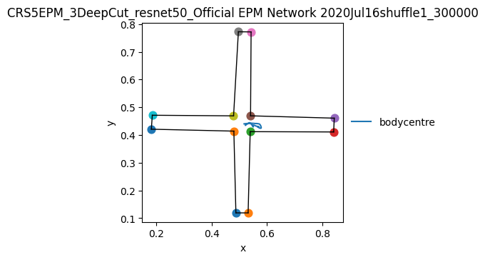

<!-- AUTO-GENERATED by tools/render_notebooks.py — do not edit manually -->

!!! example "Run this example yourself"
    [Download the epm_pipeline example](https://github.com/ETHZ-INS/py3r_behaviour/releases/latest/download/epm_pipeline.zip) — unzip and open `epm_pipeline.ipynb` in Jupyter.

set (local) paths

<div class="nb-cell-input" markdown>

```python
import os  # noqa: E402
from pathlib import Path  # noqa: E402

import numpy as np  # noqa: E402
import pandas as pd  # noqa: E402

# Inputs (bundled with the notebook)
DATA_DIR = Path("data/tracking")
TAGS_CSV = Path("data/tags.csv")

# Outputs (isolated, overridable)
OUT_DIR = Path(os.environ.get("NB_OUT_DIR", Path.cwd() / "_artifacts"))
OUT_DIR.mkdir(parents=True, exist_ok=True)
```

</div>

load a tracking collection from a folder (dlc format)

<div class="nb-cell-input" markdown>

```python
import py3r.behaviour as p3b  # noqa: E402

tc = p3b.TrackingCollection.from_dlc_folder(folder_path=DATA_DIR, fps=25)
print(tc)
```

</div>

<div class="nb-cell-output">
<pre><code>&lt;TrackingCollection with 6 Tracking objects&gt;</code></pre>
</div>

Add tags from a CSV for grouping/analysis.

CSV must contain a 'handle' column matching filenames (without extension)
other column names are the tag names, and those column values are the tag values.
See example file `tags.csv`


<div class="nb-cell-input" markdown>

```python
tc.add_tags_from_csv(csv_path=TAGS_CSV)
print(tc.tags_info())
```

</div>

<div class="nb-cell-output">
<pre><code>added 24 tags to 6 elements in collection.
           attached_to  missing_from  unique_values
tag                                                
genotype             6             0              1
id                   6             0              6
sex                  6             0              2
treatment            6             0              3</code></pre>
</div>

basic preprocessing

<div class="nb-cell-input" markdown>

```python
# Remove low-confidence detections (thresholds depend on your tracking software/data)
tc.filter_likelihood(threshold=0.5)

# Interpolate missing points before smoothing
tc.interpolate(limit=5)

# Smooth all points with mean centre window 3
tc.smooth_all(window=3, method="mean")

# Rescale distance to metres according to two corners of the EPM, here named 'tl' and 'br'
tc.rescale_by_known_distance(point1="tl", point2="br", distance_in_metres=0.655)
```

</div>

<div class="nb-cell-output">
<pre><code>BatchResult: 6 items processed (in-place)</code></pre>
</div>

basic plots

<div class="nb-cell-input" markdown>

```python
# Plot trajectories (per recording, using 'bodycentre'
# for trajectory of mouse and corners of EPM as static frame)
trajectories = ["bodycentre"]
static = ["tl", "tr", "ctr", "rt", "rb", "cbr", "br", "bl", "cbl", "lb", "lt", "ctl"]
lines = [
    ("tl", "tr"),
    ("tr", "ctr"),
    ("ctr", "rt"),
    ("rt", "rb"),
    ("rb", "cbr"),
    ("cbr", "br"),
    ("br", "bl"),
    ("bl", "cbl"),
    ("cbl", "lb"),
    ("lb", "lt"),
    ("lt", "ctl"),
    ("ctl", "tl"),
]

tc.plot(
    trajectories=trajectories,
    static=static,
    lines=lines,
    show=False,
    savedir=OUT_DIR,
)

# single inline display plot for QC:
tc[0].plot(trajectories=trajectories, static=static, lines=lines, show=True)
```

</div>

<div class="nb-cell-output">
<pre><code>
Collection: unnamed</code></pre>
</div>

<div class="nb-cell-output nb-output-figure" markdown>



</div>

<div class="nb-cell-output">
<pre><code>(&lt;Figure size 500x500 with 1 Axes&gt;,
 &lt;Axes: title={&#x27;center&#x27;: &#x27;CRS5EPM_3DeepCut_resnet50_Official EPM Network 2020Jul16shuffle1_300000&#x27;}, xlabel=&#x27;x&#x27;, ylabel=&#x27;y&#x27;&gt;)</code></pre>
</div>

create a `FeaturesCollection` object from the `TrackingCollection`

<div class="nb-cell-input" markdown>

```python
fc = p3b.FeaturesCollection.from_tracking_collection(tc)
```

</div>

compute features

<div class="nb-cell-input" markdown>

```python
# Define different boundaries (open arms, closed arms) and check if
# mouse (defined by 'bodycentre') is inside defined boundary
# Adjust boundaries so they match orientation of your EPM.
# Open arms
_oa_boundary = fc.define_boundary(["tl", "tr", "ctr", "ctl"], scaling=1.1, centre=["ctr", "ctl"])
on_oa1 = fc.within_boundary_static(point="bodycentre", boundary=_oa_boundary)
_oa_boundary = fc.define_boundary(["cbl", "cbr", "br", "bl"], scaling=1.1, centre=["cbr", "cbl"])
on_oa2 = fc.within_boundary_static(point="bodycentre", boundary=_oa_boundary)
on_oa = on_oa1 | on_oa2
on_oa.store(name="bodycentre_on_open_arms")

dist_change_on_oa = on_oa.astype("Int64") * fc.distance_change("bodycentre")
dist_change_on_oa.store(name="dist_change_bodycentre_on_oa")

# Closed arms
_ca_boundary = fc.define_boundary(["ctr", "rt", "rb", "cbr"], scaling=1.1, centre=["ctr", "cbr"])
on_ca1 = fc.within_boundary_static(point="bodycentre", boundary=_ca_boundary)
_ca_boundary = fc.define_boundary(["lt", "ctl", "cbl", "lb"], scaling=1.1, centre=["ctl", "cbl"])
on_ca2 = fc.within_boundary_static(point="bodycentre", boundary=_ca_boundary)
# you can apply binary operators to BatchResult objects
on_ca = on_ca1 | on_ca2
on_oa.store(name="bodycentre_on_closed_arms")

dist_change_on_ca = on_ca.astype("Int64") * fc.distance_change("bodycentre")
dist_change_on_ca.store(name="dist_change_bodycentre_on_ca")

# 7) (Optional) Save features to csv
fc.save(f"{OUT_DIR}/features", data_format="csv", overwrite=True)
```

</div>

<div class="nb-cell-input" markdown>

```python
# 8) Create SummaryCollection object
sc = p3b.SummaryCollection.from_features_collection(fc)

# 9) Compute summary measures per recording
# Total distance moved
sc.total_distance("bodycentre").store()

# Time on open arms
sc.time_true("bodycentre_on_open_arms").store("time_on_open_arms")

# Distance moved on open arms
sc.sum_column("dist_change_bodycentre_on_oa").store(name="distance_moved_on_open_arms")

# Time on closed arms
sc.time_true("bodycentre_on_closed_arms").store("time_on_closed_arms")

# Distance moved on closed arms
sc.sum_column("dist_change_bodycentre_on_ca").store(name="distance_moved_on_closed_arms")

# 10) Collate scalar outputs into DataFrame and save results in CSV
summary_df = sc.to_df(include_tags=True)
summary_df.to_csv(f"{OUT_DIR}/EPM_results.csv")
```

</div>

seaborn plotting wrappers (quick smoke test)
