<!-- AUTO-GENERATED by tools/render_notebooks.py — do not edit manually -->

# Open Field Test (OFT) — Full Analysis Pipeline

This notebook demonstrates a complete OFT analysis workflow using
`py3r.behaviour`, from raw DeepLabCut tracking CSVs through to
publication-ready figures and behaviour flow analysis (BFA).
The style is intentionally didactic: explain what each step does,
what it returns, and common alternatives, then run it.

**Sections**

- Setup
- Load & Preprocess
- Compute Features
- Summarise
- Visualise
- Behaviour Flow Analysis

## Setup

<div class="nb-cell-input" markdown>

```python
import json
import os
from pathlib import Path

import numpy as np
import pandas as pd

import py3r.behaviour as p3b

# Skip heavy visualisation deps (pycirclize, umap-learn) in CI
SKIP_HEAVY_VIZ = os.environ.get("CI", "").lower() in ("true", "1", "yes")

# Paths
DATA_DIR = Path("data/tracking")
TAGS_CSV = Path("data/tags.csv")

OUT_DIR = Path(os.environ.get("NB_OUT_DIR", Path.cwd() / "_artifacts"))
OUT_DIR.mkdir(parents=True, exist_ok=True)

# Constants
FPS = 30
N_CLUSTERS = 25
```

</div>

## Load & Preprocess

### Load tracking data

Load a `TrackingCollection` from a folder of DeepLabCut CSV files.
Each CSV becomes one `Tracking` object keyed by its filename stem.
The provided `fps` is written into each leaf's metadata for downstream methods.
Return type here is `TrackingCollection`.
Alternative loaders with the same pattern: `from_yolo3r_folder`, `from_dlcma_folder`.

<div class="nb-cell-input" markdown>

```python
tc = p3b.TrackingCollection.from_dlc_folder(
    folder_path=DATA_DIR,
    fps=FPS,
)
print(tc)
# Main object types in `py3r.behaviour` implement `.copy()`.
# We'll keep an untouched copy for didactic examples in this notebook.
tc_raw_for_demo = tc.copy()
```

</div>

<div class="nb-cell-output">
<pre><code>&lt;TrackingCollection with 56 Tracking objects&gt;</code></pre>
</div>

### Add experimental tags

A tags CSV maps recording handles to experimental metadata.
It must contain a `handle` column matching filenames (without extension);
every other column becomes a tag key–value pair.
`tags_info()` is a quick schema check: coverage and cardinality per tag.
`add_tags_from_csv(...)` mutates each `Tracking` in-place and returns `None`.

<div class="nb-cell-input" markdown>

```python
tc.add_tags_from_csv(csv_path=TAGS_CSV)
tc.tags_info()
```

</div>

<div class="nb-cell-output">
<pre><code>added 168 tags to 56 elements in collection.</code></pre>
</div>

<div class="nb-cell-output nb-output-table">
<div>
<style scoped>
    .dataframe tbody tr th:only-of-type {
        vertical-align: middle;
    }

    .dataframe tbody tr th {
        vertical-align: top;
    }

    .dataframe thead th {
        text-align: right;
    }
</style>
<table border="1" class="dataframe">
  <thead>
    <tr style="text-align: right;">
      <th></th>
      <th>attached_to</th>
      <th>missing_from</th>
      <th>unique_values</th>
    </tr>
    <tr>
      <th>tag</th>
      <th></th>
      <th></th>
      <th></th>
    </tr>
  </thead>
  <tbody>
    <tr>
      <th>sex</th>
      <td>56</td>
      <td>0</td>
      <td>2</td>
    </tr>
    <tr>
      <th>timepoint</th>
      <td>56</td>
      <td>0</td>
      <td>2</td>
    </tr>
    <tr>
      <th>treatment</th>
      <td>56</td>
      <td>0</td>
      <td>2</td>
    </tr>
  </tbody>
</table>
</div>
</div>

### Didactic: batch processing

With a `TrackingCollection`, `.each` delegates calls to every `Tracking`.
Think "batch call the same `Tracking` method for all recordings".

Return type follows what `Tracking` returns:

- If `Tracking` returns `None` (typical `inplace=True`), you get a `BatchResult`.
- If `Tracking` returns a `Tracking` (typical `inplace=False`), it is automatically
  upcast back to a collection (e.g. `TrackingCollection`).

Related options:
- `tc.each_forcebatch...` / `tc.each.forcebatch...`: always keep `BatchResult`.
- Passing a `BatchResult` argument back into `.each` maps values by handle
  (general pattern: mapped argument passthrough).

<div class="nb-cell-input" markdown>

```python
demo_inplace = tc_raw_for_demo.copy().each.filter_likelihood(threshold=0.9)
demo_new_collection = tc_raw_for_demo.copy().each.filter_likelihood(
    threshold=0.9,
    inplace=False,
)
print(type(demo_inplace).__name__)  # expected: BatchResult
print(type(demo_new_collection).__name__)  # expected: TrackingCollection
assert type(demo_inplace).__name__ == "BatchResult"
assert isinstance(demo_new_collection, p3b.TrackingCollection)
```

</div>

<div class="nb-cell-output">
<pre><code>BatchResult
TrackingCollection</code></pre>
</div>

### Preprocess

Standard preprocessing chain: remove low-confidence detections,
interpolate short gaps, smooth trajectories, and rescale coordinates
to real-world units.
This order is intentional: filter -> interpolate -> smooth -> rescale.

In this main path we use in-place behavior (typical analysis workflow).
Equivalent non-in-place variants are shown above in the didactic batch section.

<div class="nb-cell-input" markdown>

```python
# Main pipeline uses standard in-place preprocessing.
# `filter_likelihood`: masks low-confidence coordinates as NaN.
tc.each.filter_likelihood(threshold=0.9)
# `interpolate`: fills short NaN runs in position columns.
tc.each.interpolate(limit=5)
# `smooth_all`: denoises trajectories; options include method/window/overrides.
tc.each.smooth_all(window=3, method="mean")
# `rescale_by_known_distance`: calibrates distances to metres.
tc.each.rescale_by_known_distance(
    point1="tl",
    point2="br",
    distance_in_metres=0.64,
)
```

</div>

<div class="nb-cell-output">
<pre><code>BatchResult: 56 items processed (in-place)</code></pre>
</div>


### Quality check — trajectory plots

Save trajectory plots for every recording and display one inline for QC.
Pattern used here:
- batch save all (`tc.each.plot(..., savedir=...)`)
- inspect one representative recording inline (`tc[0].plot(...)`)

<div class="nb-cell-input" markdown>

```python
trajectories = ["bodycentre"]
static = ["tl", "tr", "bl", "br"]
lines = [("tr", "tl"), ("tl", "bl"), ("bl", "br"), ("br", "tr")]

tc.each.plot(trajectories=trajectories, static=static, lines=lines, show=False, savedir=OUT_DIR)

# Single inline plot for visual QC
tc[0].plot(trajectories=trajectories, static=static, lines=lines, show=True)
```

</div>

<div class="nb-cell-output nb-output-figure" markdown>

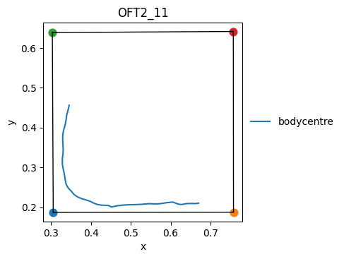

</div>

<div class="nb-cell-output">
<pre><code>(&lt;Figure size 500x500 with 1 Axes&gt;,
 &lt;Axes: title={&#x27;center&#x27;: &#x27;OFT2_11&#x27;}, xlabel=&#x27;x&#x27;, ylabel=&#x27;y&#x27;&gt;)</code></pre>
</div>

## Compute Features

### Create FeaturesCollection

A `FeaturesCollection` wraps every recording's tracking data with
methods for computing time-series features.
Most feature methods return `FeaturesResult`; call `.store()` to persist
to `Features.data` and register metadata in `Features.meta`.

Concrete rule of thumb in this notebook:
- `fc.method(...)` -> computed result object
- `... .store()` -> write to each `Features.data` table for downstream reuse

<div class="nb-cell-input" markdown>

```python
fc = p3b.FeaturesCollection.from_tracking_collection(tc)
```

</div>

### Spatial features — center zone

Define/store named boundaries on each `Features` leaf, then use either:
- mapped `BatchResult` boundary objects (smart per-handle passthrough), or
- boundary names (resolved from stored per-recording assets).
Here we use both and assert they match.

This section uses the current boundary API (`define_static_boundary`, `within_boundary`).
Older `within_boundary_static` / `distance_to_boundary_static` routes are still around but
not the preferred teaching path.

<div class="nb-cell-input" markdown>

```python
center_boundary = fc.each.define_static_boundary(
    ["tl", "tr", "bl", "br"],
    scale_dim1=0.5,
    scale_dim2=0.5,
    name="center",
)

# `center_boundary` is a BatchResult keyed by handle (one boundary per recording).
# Passing it back into `.each` maps boundary arguments to matching handles.
in_center = fc.each.within_boundary(point="bodycentre", boundary=center_boundary)
# Alternative: use stored boundary names (`"center"`) instead of explicit objects.
in_center_by_name = fc.each.within_boundary(point="bodycentre", boundary="center")
for handle in fc.keys():
    assert in_center[handle].equals(in_center_by_name[handle])

in_center.store()

# `BatchResult` supports element-wise arithmetic across handles.
# Here we gate distance moved by whether the animal is in center on each frame.
dist_change = fc.each.distance_change("bodycentre")
dist_change_in_center = in_center.astype("Int64") * dist_change
dist_change_in_center.store(name="dist_change_bodycentre_in_center")
```

</div>

### Kinematic features for BFA

Speeds, angle deviations, inter-keypoint distances, body-part areas,
and distance to the arena boundary — the standard feature set for
behavioural flow analysis clustering.
The loop pattern below intentionally stores each feature as a named column,
so later clustering/summary code can reference columns deterministically.

Specific choices used here:
- For kinematic polygons, we define named dynamic boundaries, then compute
  dynamic area (`median=False`) over their ordered points.
- For arena distance, we define named static boundaries and loop over points.

<div class="nb-cell-input" markdown>

```python
# Speeds
for pt in ["nose", "neck", "earr", "earl", "bodycentre", "hipl", "hipr", "tailbase"]:
    fc.each.speed(pt).store()

# Angle deviations
for basepoint, pointdirection1, pointdirection2 in [
    ("tailbase", "hipr", "hipl"),
    ("bodycentre", "tailbase", "neck"),
    ("neck", "bodycentre", "headcentre"),
    ("headcentre", "earr", "earl"),
]:
    fc.each.azimuth_deviation(basepoint, pointdirection1, pointdirection2).store()

# Inter-keypoint distances
for p1, p2 in [
    ("nose", "headcentre"),
    ("neck", "headcentre"),
    ("neck", "bodycentre"),
    ("bcr", "bodycentre"),
    ("bcl", "bodycentre"),
    ("tailbase", "bodycentre"),
    ("tailbase", "hipr"),
    ("tailbase", "hipl"),
    ("bcr", "hipr"),
    ("bcl", "hipl"),
    ("bcl", "earl"),
    ("bcr", "earr"),
    ("nose", "earr"),
    ("nose", "earl"),
]:
    fc.each.distance_between(p1, p2).store()

# Boundary definitions for BFA kinematic features.
# Dynamic boundaries are stored per recording, then used for dynamic area.
DYNAMIC_BODY_BOUNDARIES = [
    ("tailbase_hipr_hipl", ["tailbase", "hipr", "hipl"]),
    ("hipr_hipl_bcl_bcr", ["hipr", "hipl", "bcl", "bcr"]),
    ("bcr_earr_earl_bcl", ["bcr", "earr", "earl", "bcl"]),
    ("earr_nose_earl", ["earr", "nose", "earl"]),
]
for boundary_name, boundary_points in DYNAMIC_BODY_BOUNDARIES:
    fc.each.define_dynamic_boundary(boundary_points, name=boundary_name)
    fc.each.area_of_boundary(boundary_points, median=False).store()

# Static arena boundaries + point list for distance-to-boundary features.
STATIC_DISTANCE_BOUNDARIES = [
    ("oft", ["tl", "tr", "br", "bl"], ["nose", "neck", "bodycentre", "tailbase"]),
]
for boundary_name, boundary_points, query_points in STATIC_DISTANCE_BOUNDARIES:
    fc.each.define_static_boundary(boundary_points, name=boundary_name)
    for pt in query_points:
        fc.each.distance_to_boundary(pt, boundary_name).store()

# Inspect stored boundary assets on one recording.
# Return type: DataFrame with one row per stored boundary and columns like
# `kind`, `n_points`, `has_vertices`.
fc[0].list_boundaries()
```

</div>

<div class="nb-cell-output">
<pre><code>/Users/work/Documents/GitHub/py3r_behaviour/src/py3r/behaviour/util/base_collection.py:323: UserWarning: using fully dynamic boundary
  results[obj_key] = getattr(obj, _method_name)(*leaf_args, **leaf_kwargs)
/Users/work/Documents/GitHub/py3r_behaviour/src/py3r/behaviour/util/base_collection.py:323: UserWarning: using fully dynamic boundary
  results[obj_key] = getattr(obj, _method_name)(*leaf_args, **leaf_kwargs)
/Users/work/Documents/GitHub/py3r_behaviour/src/py3r/behaviour/util/base_collection.py:323: UserWarning: using fully dynamic boundary
  results[obj_key] = getattr(obj, _method_name)(*leaf_args, **leaf_kwargs)
/Users/work/Documents/GitHub/py3r_behaviour/src/py3r/behaviour/util/base_collection.py:323: UserWarning: using fully dynamic boundary
  results[obj_key] = getattr(obj, _method_name)(*leaf_args, **leaf_kwargs)</code></pre>
</div>

<div class="nb-cell-output nb-output-table">
<div>
<style scoped>
    .dataframe tbody tr th:only-of-type {
        vertical-align: middle;
    }

    .dataframe tbody tr th {
        vertical-align: top;
    }

    .dataframe thead th {
        text-align: right;
    }
</style>
<table border="1" class="dataframe">
  <thead>
    <tr style="text-align: right;">
      <th></th>
      <th>kind</th>
      <th>n_points</th>
      <th>has_vertices</th>
    </tr>
    <tr>
      <th>name</th>
      <th></th>
      <th></th>
      <th></th>
    </tr>
  </thead>
  <tbody>
    <tr>
      <th>center</th>
      <td>static</td>
      <td>4</td>
      <td>True</td>
    </tr>
    <tr>
      <th>tailbase_hipr_hipl</th>
      <td>dynamic</td>
      <td>3</td>
      <td>False</td>
    </tr>
    <tr>
      <th>hipr_hipl_bcl_bcr</th>
      <td>dynamic</td>
      <td>4</td>
      <td>False</td>
    </tr>
    <tr>
      <th>bcr_earr_earl_bcl</th>
      <td>dynamic</td>
      <td>4</td>
      <td>False</td>
    </tr>
    <tr>
      <th>earr_nose_earl</th>
      <td>dynamic</td>
      <td>3</td>
      <td>False</td>
    </tr>
    <tr>
      <th>oft</th>
      <td>static</td>
      <td>4</td>
      <td>True</td>
    </tr>
  </tbody>
</table>
</div>
</div>

### K-means clustering

Embed the feature time-series with temporal offsets, then cluster
the embedded space with k-means.
Returns `(cluster_labels, centroids, scaling_factors)`, where:
- `cluster_labels` is a per-handle `BatchResult` of label series
- `centroids` is a DataFrame with `n_clusters` rows

Option notes:
- `offset` controls temporal context window.
- `cluster_embedding` also supports weighting/normalization knobs for advanced runs.

<div class="nb-cell-input" markdown>

```python
features = fc[0].data.columns
offset = list(np.arange(-15, 16, 1))
embedding_dict = {f: offset for f in features}

cluster_labels, centroids, _ = fc.cluster_embedding(
    embedding_dict=embedding_dict, n_clusters=N_CLUSTERS
)
cluster_labels.store("kmeans_25", overwrite=True)
```

</div>

### Save features to disk

`save()` writes a collection manifest plus per-handle element folders.
This makes downstream loading deterministic and auditable.
Later you can reconstruct with `p3b.FeaturesCollection.load(path)`.

<div class="nb-cell-input" markdown>

```python
fc.save(f"{OUT_DIR}/features", data_format="csv", overwrite=True)
```

</div>

## Summarise

### Create SummaryCollection

Each `Summary` object holds scalar (or Series) metrics computed from
a single recording's features.
Return type here is `SummaryCollection`.

<div class="nb-cell-input" markdown>

```python
sc = p3b.SummaryCollection.from_features_collection(fc)
```

</div>

### Compute summary measures

Call summary methods and `.store()` the result to persist it.
Stored summary metrics become scalar columns in each `Summary.data` record.

Same pattern as features:
- compute result (`sc.total_distance(...)`, etc.)
- then `.store(...)` to persist by metric name.

<div class="nb-cell-input" markdown>

```python
sc.total_distance("bodycentre").store()
sc.time_true("within_boundary_static_bodycentre_in_center").store("time_in_center")
sc.sum_column("dist_change_bodycentre_in_center").store(name="distance_moved_in_center")
```

</div>

<div class="nb-cell-output">
<pre><code>/var/folders/c5/vcdvxhz16l1f6lh48b5851lw0000gp/T/ipykernel_8323/2524975100.py:1: DeprecationWarning: Direct batch passthrough via SummaryCollectionBatchMixin.total_distance() is deprecated; use SummaryCollection.each.total_distance() instead.
  sc.total_distance(&quot;bodycentre&quot;).store()
/var/folders/c5/vcdvxhz16l1f6lh48b5851lw0000gp/T/ipykernel_8323/2524975100.py:2: DeprecationWarning: Direct batch passthrough via SummaryCollectionBatchMixin.time_true() is deprecated; use SummaryCollection.each.time_true() instead.
  sc.time_true(&quot;within_boundary_static_bodycentre_in_center&quot;).store(&quot;time_in_center&quot;)
/var/folders/c5/vcdvxhz16l1f6lh48b5851lw0000gp/T/ipykernel_8323/2524975100.py:3: DeprecationWarning: Direct batch passthrough via SummaryCollectionBatchMixin.sum_column() is deprecated; use SummaryCollection.each.sum_column() instead.
  sc.sum_column(&quot;dist_change_bodycentre_in_center&quot;).store(name=&quot;distance_moved_in_center&quot;)</code></pre>
</div>

### Export results to CSV

`to_df(include_tags=True)` flattens summary metrics + selected tag columns
into one analysis-ready table (indexed by handle).

<div class="nb-cell-input" markdown>

```python
summary_df = sc.to_df(include_tags=True)
summary_df.to_csv(f"{OUT_DIR}/OFT_results.csv")
summary_df.head()
```

</div>

<div class="nb-cell-output nb-output-table">
<div>
<style scoped>
    .dataframe tbody tr th:only-of-type {
        vertical-align: middle;
    }

    .dataframe tbody tr th {
        vertical-align: top;
    }

    .dataframe thead th {
        text-align: right;
    }
</style>
<table border="1" class="dataframe">
  <thead>
    <tr style="text-align: right;">
      <th></th>
      <th>total_distance_bodycentre</th>
      <th>time_in_center</th>
      <th>distance_moved_in_center</th>
      <th>tag_timepoint</th>
      <th>tag_treatment</th>
      <th>tag_sex</th>
    </tr>
    <tr>
      <th>handle</th>
      <th></th>
      <th></th>
      <th></th>
      <th></th>
      <th></th>
      <th></th>
    </tr>
  </thead>
  <tbody>
    <tr>
      <th>OFT2_11</th>
      <td>0.554358</td>
      <td>0.0</td>
      <td>0.0</td>
      <td>post</td>
      <td>control</td>
      <td>M</td>
    </tr>
    <tr>
      <th>OFT1_6</th>
      <td>0.401730</td>
      <td>0.0</td>
      <td>0.0</td>
      <td>pre</td>
      <td>stressor</td>
      <td>F</td>
    </tr>
    <tr>
      <th>OFT1_7</th>
      <td>0.213709</td>
      <td>0.0</td>
      <td>0.0</td>
      <td>pre</td>
      <td>stressor</td>
      <td>M</td>
    </tr>
    <tr>
      <th>OFT2_10</th>
      <td>0.586084</td>
      <td>0.0</td>
      <td>0.0</td>
      <td>post</td>
      <td>stressor</td>
      <td>F</td>
    </tr>
    <tr>
      <th>OFT2_12</th>
      <td>0.369021</td>
      <td>0.0</td>
      <td>0.0</td>
      <td>post</td>
      <td>stressor</td>
      <td>F</td>
    </tr>
  </tbody>
</table>
</div>
</div>

## Visualise

The `sns*` methods on `SummaryCollection` wrap seaborn categorical plots
with sensible defaults — auto titles, y-labels, filenames, and colour
palettes.
All `sns*` helpers return `(fig, ax, tidy_df)` to support both quick plotting
and explicit downstream checks/customization.

In practice:
- pass a stored metric name (`"total_distance_bodycentre"`) for reuse
- or pass a live `SummaryResult` for one-off plotting.

### Plot types compared (ungrouped)

Three views of the same metric — `total_distance_bodycentre` — to
compare what each plot type looks like.

Also available: `snsbox`, `snsviolin`, `snspoint`, `snsswarm`.

<div class="nb-cell-input" markdown>

```python
sc.time_in_state("kmeans_25").store("time_in_cluster")
fig, ax, df_strip = sc.snsstrip(
    "time_in_cluster",
    show=True,
    savedir=OUT_DIR,
)
fig, ax, df_bar = sc.snsbar(
    "time_in_cluster",
    show=True,
    savedir=OUT_DIR,
)
fig, ax, df_super = sc.snssuperplot(
    "time_in_cluster",
    show=True,
    savedir=OUT_DIR,
)
```

</div>

<div class="nb-cell-output">
<pre><code>/var/folders/c5/vcdvxhz16l1f6lh48b5851lw0000gp/T/ipykernel_8323/3478018569.py:1: DeprecationWarning: Direct batch passthrough via SummaryCollectionBatchMixin.time_in_state() is deprecated; use SummaryCollection.each.time_in_state() instead.
  sc.time_in_state(&quot;kmeans_25&quot;).store(&quot;time_in_cluster&quot;)</code></pre>
</div>

<div class="nb-cell-output nb-output-figure" markdown>


</div>

<div class="nb-cell-output nb-output-figure" markdown>


</div>

<div class="nb-cell-output nb-output-figure" markdown>


</div>

### Single Summary delegation

Individual `Summary` objects can call the same `sns*` methods.
They delegate to a 1-item `SummaryCollection` internally.
The auto filename is prefixed with the recording handle.

<div class="nb-cell-input" markdown>

```python
single = sc[list(sc.keys())[0]]
fig, ax, df_single = single.snsbar(
    single.time_in_state("within_boundary_static_bodycentre_in_center"),
    show=True,
    savedir=OUT_DIR,
)
```

</div>

<div class="nb-cell-output nb-output-figure" markdown>


</div>

### Grouped plots

Group by experimental tags with `groupby()`.
Use `group_order` to control how groups are arranged on the x-axis.
`groupby(...)` returns a grouped `SummaryCollection` view with same plotting API.

<div class="nb-cell-input" markdown>

```python
sc_grouped = sc.groupby(tags=["treatment", "timepoint"])

# Keys = tag names (must match groupby tags), values = desired display order
GROUP_ORDER = {"treatment": ["control", "stressor"], "timepoint": ["pre", "post"]}
```

</div>

<div class="nb-cell-input" markdown>

```python
# Scalar metric — grouped superplot
fig, ax, df_gsup = sc_grouped.snssuperplot(
    "total_distance_bodycentre",
    group_order=GROUP_ORDER,
    show=True,
    savedir=str(OUT_DIR),
)
```

</div>

<div class="nb-cell-output nb-output-figure" markdown>


</div>

<div class="nb-cell-input" markdown>

```python
# Multi-component metric — 25 clusters × 4 groups
fig, ax, df_gbar = sc_grouped.snsbar(
    sc_grouped.time_in_state("kmeans_25"),
    group_order=GROUP_ORDER,
    show=True,
    savedir=str(OUT_DIR),
)
```

</div>

<div class="nb-cell-output">
<pre><code>/var/folders/c5/vcdvxhz16l1f6lh48b5851lw0000gp/T/ipykernel_8323/2921511720.py:3: DeprecationWarning: Direct batch passthrough via SummaryCollectionBatchMixin.time_in_state() is deprecated; use SummaryCollection.each.time_in_state() instead.
  sc_grouped.time_in_state(&quot;kmeans_25&quot;),</code></pre>
</div>

<div class="nb-cell-output nb-output-figure" markdown>

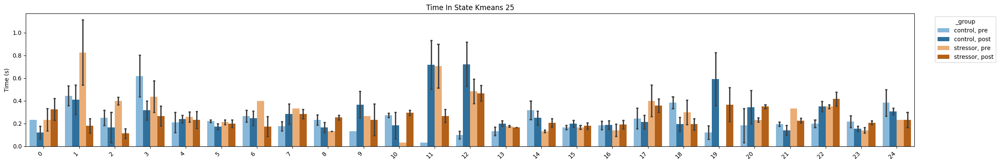

</div>

Even though the summary metric 'time_in_cluster' was created before grouping, the grouped plots
work as expected with this summary metric (but the auto-generated title is different, because we
stored it with a manual name).

<div class="nb-cell-input" markdown>

```python
# Multi-component metric — 25 clusters × 4 groups
fig, ax, df_gbar = sc_grouped.snsbar(
    "time_in_cluster",
    group_order=GROUP_ORDER,
    show=True,
    savedir=str(OUT_DIR),
)
```

</div>

<div class="nb-cell-output nb-output-figure" markdown>


</div>

### sort_by — independent spatial ordering

`sort_by` overrides the spatial arrangement on the x-axis without changing
colour assignment.  Here `groupby(tags=["treatment", "timepoint"])` means
treatment drives the base colour (control=blue, FST=orange).  Adding
`sort_by="timepoint"` interleaves control/FST within each timepoint.

<div class="nb-cell-input" markdown>

```python
# Interleaved superplot — timepoint as primary spatial axis, colours by treatment
fig, ax, df_interleaved = sc_grouped.snssuperplot(
    "total_distance_bodycentre",
    group_order=GROUP_ORDER,
    sort_by="timepoint",
    show=True,
    savedir=str(OUT_DIR),
    filename="total_distance_interleaved_superplot.png",
)
```

</div>

<div class="nb-cell-output nb-output-figure" markdown>

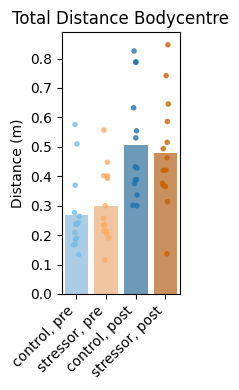

</div>

<div class="nb-cell-input" markdown>

```python
# Power-user workflow with prepare_plot — full seaborn control
import seaborn as sns

spec = sc_grouped.prepare_plot(
    "total_distance_bodycentre",
    group_order=GROUP_ORDER,
    sort_by=["timepoint", "treatment"],
)
sns.boxplot(**spec.sns_kwargs, width=0.6)
spec.ax.set_ylabel(spec.ylabel)
spec.ax.set_title("Custom: prepare_plot + boxplot")
import matplotlib.pyplot as plt

plt.xticks(rotation=90)
plt.tight_layout()
plt.show()
```

</div>

<div class="nb-cell-output nb-output-figure" markdown>

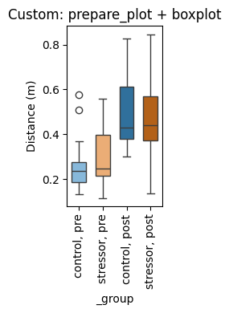

</div>

### Statistical annotations

Use `annotate="help"` to discover available tests, corrections, and the
group labels in your data. Then pass `annotate={...}` with actual pairs.

<div class="nb-cell-input" markdown>

```python
# Discover labels and options (no annotation applied, just prints a guide)
fig_ann, ax_ann, df_ann = sc_grouped.snssuperplot(
    "total_distance_bodycentre",
    group_order=GROUP_ORDER,
    annotate="help",
    show=False,
)
```

</div>

<div class="nb-cell-output">
<pre><code>=== Statistical Annotation Guide ===

annotate={
    &quot;pairs&quot;: [(&quot;groupA&quot;, &quot;groupB&quot;), ...],  # REQUIRED
    &quot;test&quot;: &quot;Mann-Whitney&quot;,                # see below
    &quot;correction&quot;: None,                    # see below
    &quot;text_format&quot;: &quot;star&quot;,                 # &quot;star&quot;, &quot;simple&quot;, &quot;full&quot;
    &quot;headroom&quot;: None,                      # float multiplier, see below
}

Available tests:
  Parametric:     t-test_ind, t-test_welch, t-test_paired
  Non-parametric: Mann-Whitney, Wilcoxon, Kruskal, Brunner-Munzel
  Other:          Levene (variance equality)

  Tip: Mann-Whitney is a safe default for most behavioural data.
  Use paired tests (t-test_paired, Wilcoxon) for repeated measures.
  Use parametric tests only if data is normally distributed.

Multiple comparisons correction (recommended for &gt;3 pairs):
  FWER (conservative): bonferroni, holm
  FDR  (less conservative): fdr_bh (Benjamini-Hochberg), fdr_by

Headroom:
  Extra vertical space for brackets, as a fraction of the y range.
  E.g. headroom=0.3 adds 30%% extra room above the data.

Your labels: [&#x27;control, post&#x27;, &#x27;control, pre&#x27;, &#x27;stressor, post&#x27;, &#x27;stressor, pre&#x27;]</code></pre>
</div>

<div class="nb-cell-input" markdown>

```python
# Apply annotations
fig_ann, ax_ann, df_ann = sc_grouped.snsbox(
    "total_distance_bodycentre",
    group_order=GROUP_ORDER,
    annotate={
        "pairs": [("control, pre", "stressor, pre"), ("control, post", "stressor, post")],
        "test": "Mann-Whitney",
        "correction": None,
        "text_format": "star",
        "headroom": 0.0,  # add extra space for annotations if needed
    },
    savedir=str(OUT_DIR),
    filename="total_distance_annotated_superplot.png",
    show=True,
)
```

</div>

<div class="nb-cell-output">
<pre><code>p-value annotation legend:
      ns: 5.00e-02 &lt; p &lt;= 1.00e+00
       *: 1.00e-02 &lt; p &lt;= 5.00e-02
      **: 1.00e-03 &lt; p &lt;= 1.00e-02
     ***: 1.00e-04 &lt; p &lt;= 1.00e-03
    ****: p &lt;= 1.00e-04

control, pre vs. stressor, pre: Mann-Whitney-Wilcoxon test two-sided, P_val:4.484e-01 U_stat=8.100e+01
control, post vs. stressor, post: Mann-Whitney-Wilcoxon test two-sided, P_val:8.722e-01 U_stat=1.020e+02</code></pre>
</div>

<div class="nb-cell-output nb-output-figure" markdown>

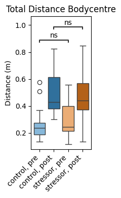

</div>

### Metric input options

Two ways to pass a metric to any `sns*` method:

1. **String key** — a previously stored metric name
2. **SummaryResult** object — inline computation (not stored)
(Both of these may be either single component,  or multi-component)

<div class="nb-cell-input" markdown>

```python
# 1. String key
fig, ax, _ = sc.snsstrip("total_distance_bodycentre", show=False)

# 2. SummaryResult object (inline)
fig, ax, df_mc = sc.snsbar(
    sc.time_in_state("within_boundary_static_bodycentre_in_center"),
    show=False,
)
```

</div>

<div class="nb-cell-output">
<pre><code>/var/folders/c5/vcdvxhz16l1f6lh48b5851lw0000gp/T/ipykernel_8323/2247942772.py:6: DeprecationWarning: Direct batch passthrough via SummaryCollectionBatchMixin.time_in_state() is deprecated; use SummaryCollection.each.time_in_state() instead.
  sc.time_in_state(&quot;within_boundary_static_bodycentre_in_center&quot;),</code></pre>
</div>

## Behaviour Flow Analysis (BFA)

### Compute BFA results and statistics

`bfa()` returns a nested dict of observed/shuffled transition statistics,
and `bfa_stats()` derives effect-size-style summaries for reporting.
`all_states=np.arange(0, N_CLUSTERS)` makes the state space explicit.

<div class="nb-cell-input" markdown>

```python
bfa_results = sc_grouped.bfa(column="kmeans_25", all_states=np.arange(0, N_CLUSTERS))
bfa_stats = p3b.SummaryCollection.bfa_stats(bfa_results)

with open(f"{OUT_DIR}/bfa_results.json", "w") as f:
    json.dump(bfa_results, f, indent=4)
with open(f"{OUT_DIR}/bfa_stats.json", "w") as f:
    json.dump(bfa_stats, f, indent=4)
```

</div>

### BFA histograms

Distribution of shuffled transition values vs observed, per group comparison.
Useful as a quick sanity check before interpreting chord/UMAP views.

<div class="nb-cell-input" markdown>

```python
p3b.SummaryCollection.plot_bfa_results(
    bfa_results,
    add_stats=True,
    stats=bfa_stats,
    bins=20,
    figsize=(4, 3),
    save_dir=OUT_DIR,
    show=True,
)
```

</div>

<div class="nb-cell-output nb-output-figure" markdown>

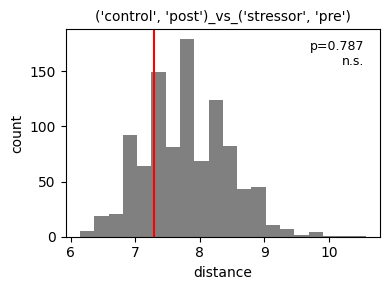

</div>

<div class="nb-cell-output nb-output-figure" markdown>

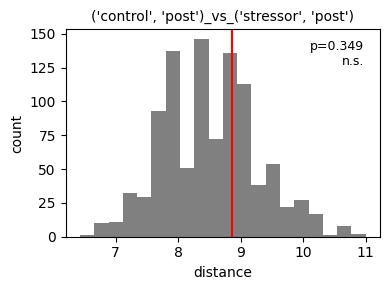

</div>

<div class="nb-cell-output nb-output-figure" markdown>

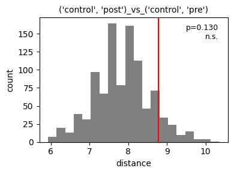

</div>

<div class="nb-cell-output nb-output-figure" markdown>

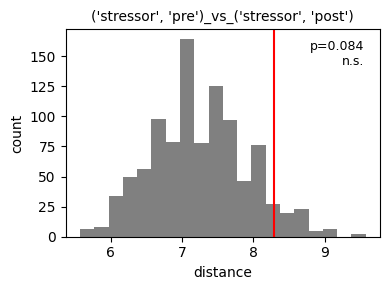

</div>

<div class="nb-cell-output nb-output-figure" markdown>

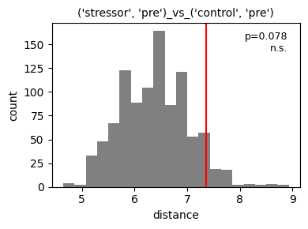

</div>

<div class="nb-cell-output nb-output-figure" markdown>

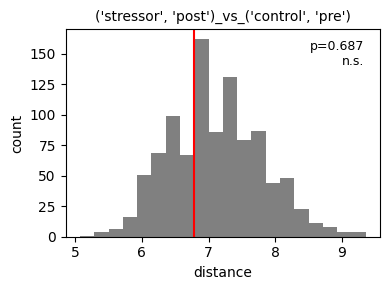

</div>

<div class="nb-cell-output">
<pre><code>{&quot;(&#x27;control&#x27;, &#x27;post&#x27;)_vs_(&#x27;stressor&#x27;, &#x27;pre&#x27;)&quot;: (&lt;Figure size 400x300 with 1 Axes&gt;,
  &lt;Axes: title={&#x27;center&#x27;: &quot;(&#x27;control&#x27;, &#x27;post&#x27;)_vs_(&#x27;stressor&#x27;, &#x27;pre&#x27;)&quot;}, xlabel=&#x27;distance&#x27;, ylabel=&#x27;count&#x27;&gt;),
 &quot;(&#x27;control&#x27;, &#x27;post&#x27;)_vs_(&#x27;stressor&#x27;, &#x27;post&#x27;)&quot;: (&lt;Figure size 400x300 with 1 Axes&gt;,
  &lt;Axes: title={&#x27;center&#x27;: &quot;(&#x27;control&#x27;, &#x27;post&#x27;)_vs_(&#x27;stressor&#x27;, &#x27;post&#x27;)&quot;}, xlabel=&#x27;distance&#x27;, ylabel=&#x27;count&#x27;&gt;),
 &quot;(&#x27;control&#x27;, &#x27;post&#x27;)_vs_(&#x27;control&#x27;, &#x27;pre&#x27;)&quot;: (&lt;Figure size 400x300 with 1 Axes&gt;,
  &lt;Axes: title={&#x27;center&#x27;: &quot;(&#x27;control&#x27;, &#x27;post&#x27;)_vs_(&#x27;control&#x27;, &#x27;pre&#x27;)&quot;}, xlabel=&#x27;distance&#x27;, ylabel=&#x27;count&#x27;&gt;),
 &quot;(&#x27;stressor&#x27;, &#x27;pre&#x27;)_vs_(&#x27;stressor&#x27;, &#x27;post&#x27;)&quot;: (&lt;Figure size 400x300 with 1 Axes&gt;,
  &lt;Axes: title={&#x27;center&#x27;: &quot;(&#x27;stressor&#x27;, &#x27;pre&#x27;)_vs_(&#x27;stressor&#x27;, &#x27;post&#x27;)&quot;}, xlabel=&#x27;distance&#x27;, ylabel=&#x27;count&#x27;&gt;),
 &quot;(&#x27;stressor&#x27;, &#x27;pre&#x27;)_vs_(&#x27;control&#x27;, &#x27;pre&#x27;)&quot;: (&lt;Figure size 400x300 with 1 Axes&gt;,
  &lt;Axes: title={&#x27;center&#x27;: &quot;(&#x27;stressor&#x27;, &#x27;pre&#x27;)_vs_(&#x27;control&#x27;, &#x27;pre&#x27;)&quot;}, xlabel=&#x27;distance&#x27;, ylabel=&#x27;count&#x27;&gt;),
 &quot;(&#x27;stressor&#x27;, &#x27;post&#x27;)_vs_(&#x27;control&#x27;, &#x27;pre&#x27;)&quot;: (&lt;Figure size 400x300 with 1 Axes&gt;,
  &lt;Axes: title={&#x27;center&#x27;: &quot;(&#x27;stressor&#x27;, &#x27;post&#x27;)_vs_(&#x27;control&#x27;, &#x27;pre&#x27;)&quot;}, xlabel=&#x27;distance&#x27;, ylabel=&#x27;count&#x27;&gt;)}</code></pre>
</div>

### Chord diagrams

Requires `pycirclize` — install with `pip install py3r-behaviour[viz]`.

<div class="nb-cell-input" markdown>

```python
if not SKIP_HEAVY_VIZ:
    sc_grouped.plot_chord(
        column="kmeans_25",
        all_states=np.arange(0, N_CLUSTERS),
        save_dir=OUT_DIR,
        show=True,
        start=-265,
        end=95,
        space=5,
        r_lim=(93, 100),
        label_kws=dict(r=94, size=12, color="white"),
        link_kws=dict(ec="black", lw=0.5),
    )
```

</div>

<div class="nb-cell-output nb-output-figure" markdown>

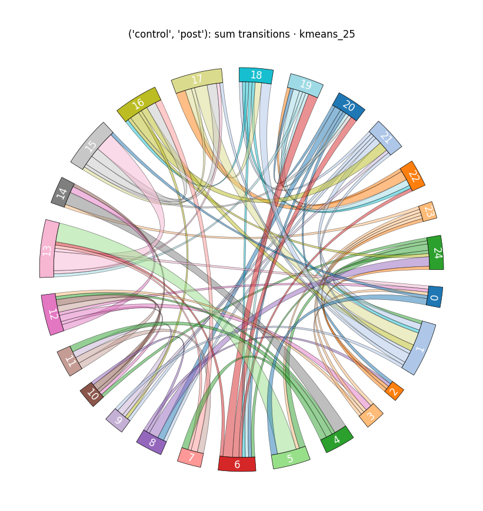

</div>

<div class="nb-cell-output nb-output-figure" markdown>

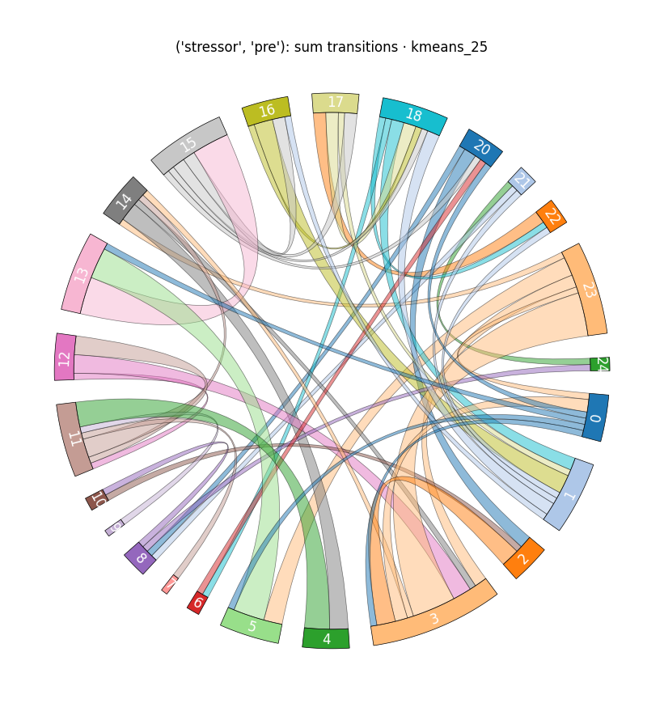

</div>

<div class="nb-cell-output nb-output-figure" markdown>

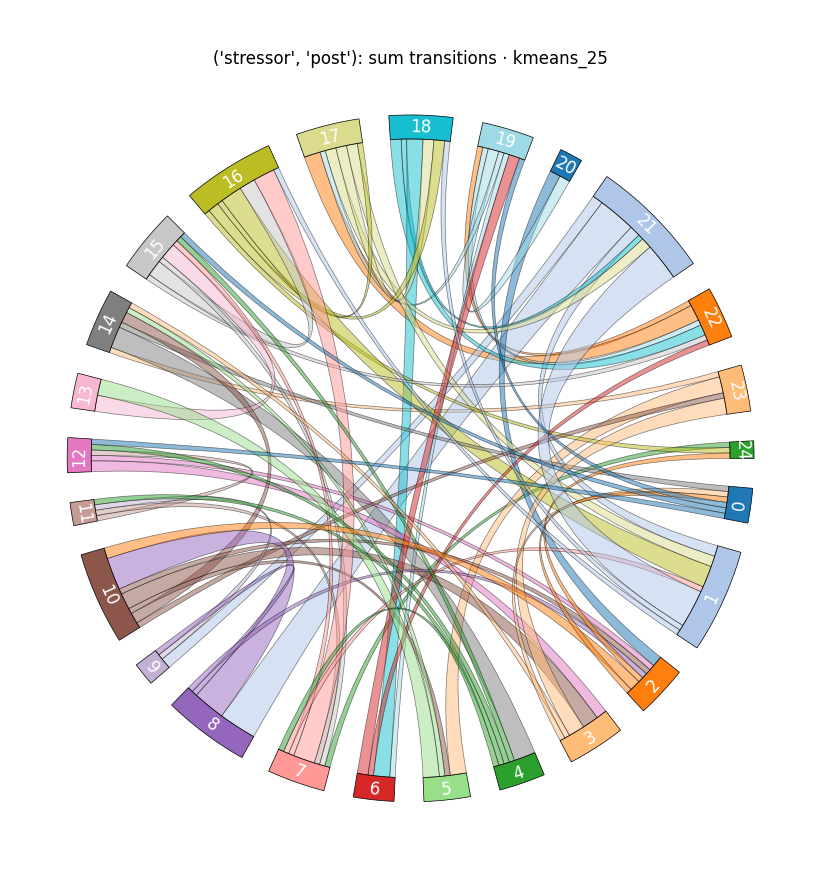

</div>

<div class="nb-cell-output nb-output-figure" markdown>

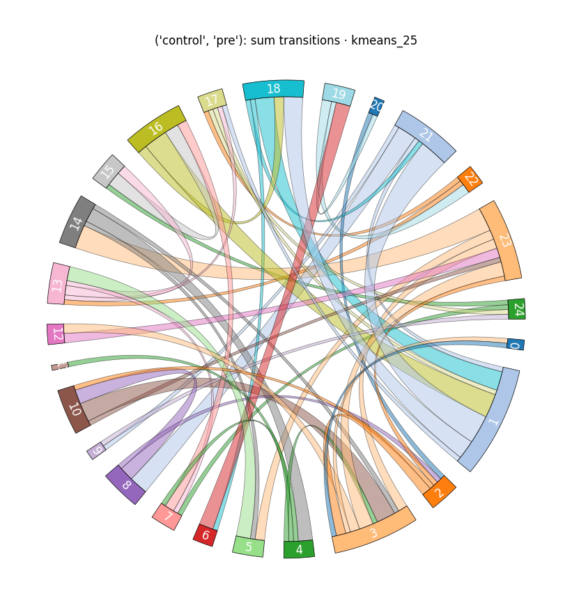

</div>

### UMAP embedding of transition matrices

Requires `umap-learn` — install with `pip install py3r-behaviour[viz]`.

<div class="nb-cell-input" markdown>

```python
if not SKIP_HEAVY_VIZ:
    fig, ax = sc_grouped.plot_transition_umap(
        column="kmeans_25",
        all_states=np.arange(0, N_CLUSTERS),
        n_neighbors=15,
        min_dist=0.1,
        random_state=42,
        figsize=(6, 5),
        show=True,
        save_dir=str(OUT_DIR),
    )
```

</div>

<div class="nb-cell-output">
<pre><code>/Users/work/Documents/GitHub/py3r_behaviour/.venv/lib/python3.12/site-packages/tqdm/auto.py:21: TqdmWarning: IProgress not found. Please update jupyter and ipywidgets. See https://ipywidgets.readthedocs.io/en/stable/user_install.html
  from .autonotebook import tqdm as notebook_tqdm</code></pre>
</div>

<div class="nb-cell-output">
<pre><code>/Users/work/Documents/GitHub/py3r_behaviour/.venv/lib/python3.12/site-packages/umap/umap_.py:1952: UserWarning: n_jobs value 1 overridden to 1 by setting random_state. Use no seed for parallelism.
  warn(</code></pre>
</div>

<div class="nb-cell-output nb-output-figure" markdown>

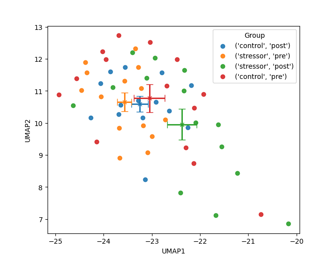

</div>

## Done
