<!-- AUTO-GENERATED by tools/render_notebooks.py — do not edit manually -->

# Open Field Test (OFT) — Full Analysis Pipeline

This notebook demonstrates a complete OFT analysis workflow using
`py3r.behaviour`, from raw DeepLabCut tracking CSVs through to
publication-ready figures and behaviour flow analysis (BFA).

**Sections**

1. Setup
2. Load & Preprocess
3. Compute Features
4. Summarise
5. Visualise
6. Behaviour Flow Analysis

## 1. Setup

<div class="nb-cell-input" markdown>

```python
TEST_MODE = True

import json
import os
from pathlib import Path

import numpy as np
import pandas as pd

import py3r.behaviour as p3b

# Skip heavy visualisation deps (pycirclize, umap-learn) in CI
SKIP_HEAVY_VIZ = os.environ.get("CI", "").lower() in ("true", "1", "yes")

# Paths — point these at your own data outside test mode
if TEST_MODE:
    DATA_DIR = Path("data/tracking")
    TAGS_CSV = Path("data/tags.csv")
else:
    raise NotImplementedError("Example dataset artifact not yet bundled with package")

OUT_DIR = Path(os.environ.get("NB_OUT_DIR", Path.cwd() / "_artifacts"))
OUT_DIR.mkdir(parents=True, exist_ok=True)

# Constants
FPS = 25
N_CLUSTERS = 25
```

</div>

## 2. Load & Preprocess

### 2.1 Load tracking data

Load a `TrackingCollection` from a folder of DeepLabCut CSV files.
Each CSV becomes one `Tracking` object keyed by its filename stem.

<div class="nb-cell-input" markdown>

```python
tc = p3b.TrackingCollection.from_dlc_folder(
    folder_path=DATA_DIR,
    fps=FPS,
    aspectratio_correction=0.75,
)
print(tc)
```

</div>

<div class="nb-cell-output">
<pre><code>&lt;TrackingCollection with 24 Tracking objects&gt;</code></pre>
</div>

### 2.2 Add experimental tags

A tags CSV maps recording handles to experimental metadata.
It must contain a `handle` column matching filenames (without extension);
every other column becomes a tag key–value pair.

<div class="nb-cell-input" markdown>

```python
tc.add_tags_from_csv(csv_path=TAGS_CSV)
tc.tags_info()
```

</div>

<div class="nb-cell-output">
<pre><code>added 48 tags to 24 elements in collection.</code></pre>
</div>

<div class="nb-cell-output nb-output-table">
<div>
<style scoped>
    .dataframe tbody tr th:only-of-type {
        vertical-align: middle;
    }

    .dataframe tbody tr th {
        vertical-align: top;
    }

    .dataframe thead th {
        text-align: right;
    }
</style>
<table border="1" class="dataframe">
  <thead>
    <tr style="text-align: right;">
      <th></th>
      <th>attached_to</th>
      <th>missing_from</th>
      <th>unique_values</th>
    </tr>
    <tr>
      <th>tag</th>
      <th></th>
      <th></th>
      <th></th>
    </tr>
  </thead>
  <tbody>
    <tr>
      <th>timepoint</th>
      <td>24</td>
      <td>0</td>
      <td>2</td>
    </tr>
    <tr>
      <th>treatment</th>
      <td>24</td>
      <td>0</td>
      <td>2</td>
    </tr>
  </tbody>
</table>
</div>
</div>

### 2.3 Preprocess

Standard preprocessing chain: remove low-confidence detections,
interpolate short gaps, smooth trajectories, and rescale coordinates
to real-world units.

<div class="nb-cell-input" markdown>

```python
tc.filter_likelihood(threshold=0.5)
tc.interpolate(limit=5)
tc.smooth_all(window=3, method="mean")
tc.rescale_by_known_distance(point1="tl", point2="br", distance_in_metres=0.64)
```

</div>

<div class="nb-cell-output">
<pre><code>BatchResult: 24 items processed (in-place)</code></pre>
</div>

### 2.4 Quality check — trajectory plots

Save trajectory plots for every recording and display one inline for QC.

<div class="nb-cell-input" markdown>

```python
trajectories = ["bodycentre"]
static = ["tl", "tr", "bl", "br"]
lines = [("tr", "tl"), ("tl", "bl"), ("bl", "br"), ("br", "tr")]

tc.plot(trajectories=trajectories, static=static, lines=lines, show=False, savedir=OUT_DIR)

# Single inline plot for visual QC
tc[0].plot(trajectories=trajectories, static=static, lines=lines, show=True)
```

</div>

<div class="nb-cell-output">
<pre><code>
Collection: unnamed</code></pre>
</div>

<div class="nb-cell-output nb-output-figure" markdown>

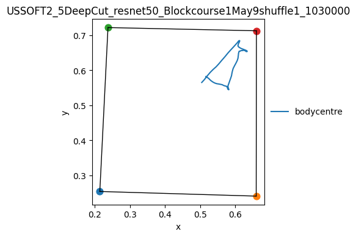

</div>

<div class="nb-cell-output">
<pre><code>(&lt;Figure size 500x500 with 1 Axes&gt;,
 &lt;Axes: title={&#x27;center&#x27;: &#x27;USSOFT2_5DeepCut_resnet50_Blockcourse1May9shuffle1_1030000&#x27;}, xlabel=&#x27;x&#x27;, ylabel=&#x27;y&#x27;&gt;)</code></pre>
</div>

## 3. Compute Features

### 3.1 Create FeaturesCollection

A `FeaturesCollection` wraps every recording's tracking data with
methods for computing time-series features.

<div class="nb-cell-input" markdown>

```python
fc = p3b.FeaturesCollection.from_tracking_collection(tc)
```

</div>

### 3.2 Spatial features — center zone

Define the center boundary from the arena corners and detect
when the mouse (bodycentre) is inside it.

<div class="nb-cell-input" markdown>

```python
center_boundary = fc.define_boundary(["tl", "tr", "bl", "br"], scaling=0.5)
in_center = fc.within_boundary_static(
    point="bodycentre", boundary=center_boundary, boundary_name="center"
)
in_center.store()

dist_change = fc.distance_change("bodycentre")
dist_change_in_center = in_center.astype("Int64") * dist_change
dist_change_in_center.store(name="dist_change_bodycentre_in_center")
```

</div>

### 3.3 Kinematic features for BFA

Speeds, angle deviations, inter-keypoint distances, body-part areas,
and distance to the arena boundary — the standard feature set for
behavioural flow analysis clustering.

<div class="nb-cell-input" markdown>

```python
# Speeds
for pt in ["nose", "neck", "earr", "earl", "bodycentre", "hipl", "hipr", "tailbase"]:
    fc.speed(pt).store()

# Angle deviations
fc.azimuth_deviation("tailbase", "hipr", "hipl").store()
fc.azimuth_deviation("bodycentre", "tailbase", "neck").store()
fc.azimuth_deviation("neck", "bodycentre", "headcentre").store()
fc.azimuth_deviation("headcentre", "earr", "earl").store()

# Inter-keypoint distances
for p1, p2 in [
    ("nose", "headcentre"),
    ("neck", "headcentre"),
    ("neck", "bodycentre"),
    ("bcr", "bodycentre"),
    ("bcl", "bodycentre"),
    ("tailbase", "bodycentre"),
    ("tailbase", "hipr"),
    ("tailbase", "hipl"),
    ("bcr", "hipr"),
    ("bcl", "hipl"),
    ("bcl", "earl"),
    ("bcr", "earr"),
    ("nose", "earr"),
    ("nose", "earl"),
]:
    fc.distance_between(p1, p2).store()

# Body-part areas
fc.area_of_boundary(["tailbase", "hipr", "hipl"], median=False).store()
fc.area_of_boundary(["hipr", "hipl", "bcl", "bcr"], median=False).store()
fc.area_of_boundary(["bcr", "earr", "earl", "bcl"], median=False).store()
fc.area_of_boundary(["earr", "nose", "earl"], median=False).store()

# Distance to arena boundary
bdry = fc.define_boundary(["tl", "tr", "br", "bl"], scaling=1.0)
for pt in ["nose", "neck", "bodycentre", "tailbase"]:
    fc.distance_to_boundary_static(pt, bdry, boundary_name="oft").store()
```

</div>

<div class="nb-cell-output">
<pre><code>/Users/work/Documents/GitHub/py3r_behaviour/src/py3r/behaviour/util/base_collection.py:94: UserWarning: using fully dynamic boundary
  results[key] = getattr(obj, _method_name)(*args, **kwargs)
/Users/work/Documents/GitHub/py3r_behaviour/src/py3r/behaviour/util/base_collection.py:94: UserWarning: using fully dynamic boundary
  results[key] = getattr(obj, _method_name)(*args, **kwargs)
/Users/work/Documents/GitHub/py3r_behaviour/src/py3r/behaviour/util/base_collection.py:94: UserWarning: using fully dynamic boundary
  results[key] = getattr(obj, _method_name)(*args, **kwargs)
/Users/work/Documents/GitHub/py3r_behaviour/src/py3r/behaviour/util/base_collection.py:94: UserWarning: using fully dynamic boundary
  results[key] = getattr(obj, _method_name)(*args, **kwargs)</code></pre>
</div>

### 3.4 K-means clustering

Embed the feature time-series with temporal offsets, then cluster
the embedded space with k-means.

<div class="nb-cell-input" markdown>

```python
features = fc[0].data.columns
offset = list(np.arange(-15, 16, 1))
embedding_dict = {f: offset for f in features}

cluster_labels, centroids, _ = fc.cluster_embedding(
    embedding_dict=embedding_dict, n_clusters=N_CLUSTERS
)
cluster_labels.store("kmeans_25", overwrite=True)
```

</div>

### 3.5 Save features to disk

<div class="nb-cell-input" markdown>

```python
fc.save(f"{OUT_DIR}/features", data_format="csv", overwrite=True)
```

</div>

## 4. Summarise

### 4.1 Create SummaryCollection

Each `Summary` object holds scalar (or Series) metrics computed from
a single recording's features.

<div class="nb-cell-input" markdown>

```python
sc = p3b.SummaryCollection.from_features_collection(fc)
```

</div>

### 4.2 Compute summary measures

Call summary methods and `.store()` the result to persist it.

<div class="nb-cell-input" markdown>

```python
sc.total_distance("bodycentre").store()
sc.time_true("within_boundary_static_bodycentre_in_center").store("time_in_center")
sc.sum_column("dist_change_bodycentre_in_center").store(name="distance_moved_in_center")
```

</div>

### 4.3 Export results to CSV

<div class="nb-cell-input" markdown>

```python
summary_df = sc.to_df(include_tags=True)
summary_df.to_csv(f"{OUT_DIR}/OFT_results.csv")
summary_df.head()
```

</div>

<div class="nb-cell-output nb-output-table">
<div>
<style scoped>
    .dataframe tbody tr th:only-of-type {
        vertical-align: middle;
    }

    .dataframe tbody tr th {
        vertical-align: top;
    }

    .dataframe thead th {
        text-align: right;
    }
</style>
<table border="1" class="dataframe">
  <thead>
    <tr style="text-align: right;">
      <th></th>
      <th>total_distance_bodycentre</th>
      <th>time_in_center</th>
      <th>distance_moved_in_center</th>
      <th>tag_timepoint</th>
      <th>tag_treatment</th>
    </tr>
    <tr>
      <th>handle</th>
      <th></th>
      <th></th>
      <th></th>
      <th></th>
      <th></th>
    </tr>
  </thead>
  <tbody>
    <tr>
      <th>USSOFT2_5DeepCut_resnet50_Blockcourse1May9shuffle1_1030000</th>
      <td>0.430189</td>
      <td>0.32</td>
      <td>0.057087</td>
      <td>1d</td>
      <td>FST</td>
    </tr>
    <tr>
      <th>USSOFT2_11DeepCut_resnet50_Blockcourse1May9shuffle1_1030000</th>
      <td>2.154820</td>
      <td>0.20</td>
      <td>0.383825</td>
      <td>1d</td>
      <td>control</td>
    </tr>
    <tr>
      <th>USSOFT1_6DeepCut_resnet50_Blockcourse1May9shuffle1_1030000</th>
      <td>0.503431</td>
      <td>2.08</td>
      <td>0.314483</td>
      <td>45m</td>
      <td>control</td>
    </tr>
    <tr>
      <th>USSOFT2_7DeepCut_resnet50_Blockcourse1May9shuffle1_1030000</th>
      <td>1.817500</td>
      <td>0.04</td>
      <td>0.143321</td>
      <td>1d</td>
      <td>FST</td>
    </tr>
    <tr>
      <th>USSOFT2_13DeepCut_resnet50_Blockcourse1May9shuffle1_1030000</th>
      <td>0.683247</td>
      <td>0.20</td>
      <td>0.162883</td>
      <td>1d</td>
      <td>FST</td>
    </tr>
  </tbody>
</table>
</div>
</div>

## 5. Visualise

The `sns*` methods on `SummaryCollection` wrap seaborn categorical plots
with sensible defaults — auto titles, y-labels, filenames, and colour
palettes.

### 5.1 Plot types compared (ungrouped)

Three views of the same metric — `total_distance_bodycentre` — to
compare what each plot type looks like.

Also available: `snsbox`, `snsviolin`, `snspoint`, `snsswarm`.

<div class="nb-cell-input" markdown>

```python
sc.time_in_state("kmeans_25").store("time_in_cluster")
fig, ax, df_strip = sc.snsstrip(
    "time_in_cluster",
    show=True,
    savedir=OUT_DIR,
)
fig, ax, df_bar = sc.snsbar(
    "time_in_cluster",
    show=True,
    savedir=OUT_DIR,
)
fig, ax, df_super = sc.snssuperplot(
    "time_in_cluster",
    show=True,
    savedir=OUT_DIR,
)
```

</div>

<div class="nb-cell-output nb-output-figure" markdown>

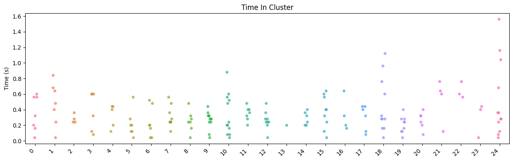

</div>

<div class="nb-cell-output nb-output-figure" markdown>

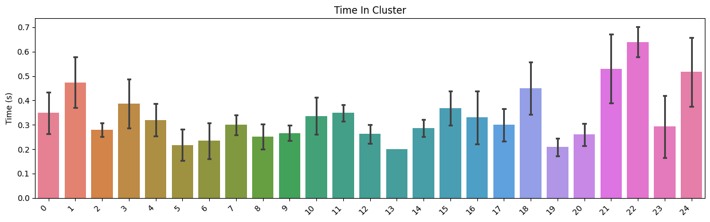

</div>

<div class="nb-cell-output nb-output-figure" markdown>

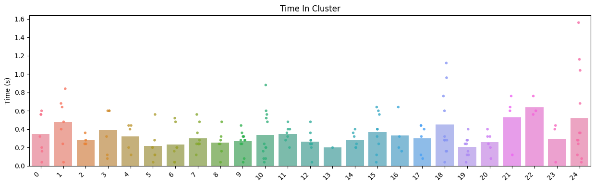

</div>

### 5.2 Single Summary delegation

Individual `Summary` objects can call the same `sns*` methods.
They delegate to a 1-item `SummaryCollection` internally.
The auto filename is prefixed with the recording handle.

<div class="nb-cell-input" markdown>

```python
single = sc[list(sc.keys())[0]]
fig, ax, df_single = single.snsbar(
    single.time_in_state("within_boundary_static_bodycentre_in_center"),
    show=True,
    savedir=OUT_DIR,
)
```

</div>

<div class="nb-cell-output nb-output-figure" markdown>

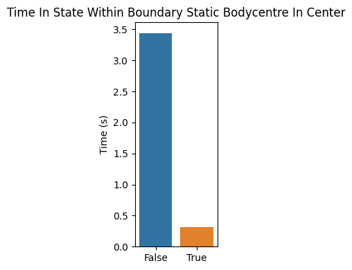

</div>

### 5.3 Grouped plots

Group by experimental tags with `groupby()`.
Use `group_order` to control how groups are arranged on the x-axis.

<div class="nb-cell-input" markdown>

```python
sc_grouped = sc.groupby(tags=["treatment", "timepoint"])

# Keys = tag names (must match groupby tags), values = desired display order
GROUP_ORDER = {"treatment": ["control", "FST"], "timepoint": ["45m", "1d"]}
```

</div>

<div class="nb-cell-input" markdown>

```python
# Scalar metric — grouped superplot
fig, ax, df_gsup = sc_grouped.snssuperplot(
    "total_distance_bodycentre",
    group_order=GROUP_ORDER,
    show=True,
    savedir=str(OUT_DIR),
)
```

</div>

<div class="nb-cell-output nb-output-figure" markdown>

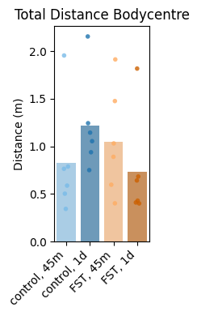

</div>

<div class="nb-cell-input" markdown>

```python
# Multi-component metric — 25 clusters × 4 groups
fig, ax, df_gbar = sc_grouped.snsbar(
    sc_grouped.time_in_state("kmeans_25"),
    group_order=GROUP_ORDER,
    show=True,
    savedir=str(OUT_DIR),
)
```

</div>

<div class="nb-cell-output nb-output-figure" markdown>

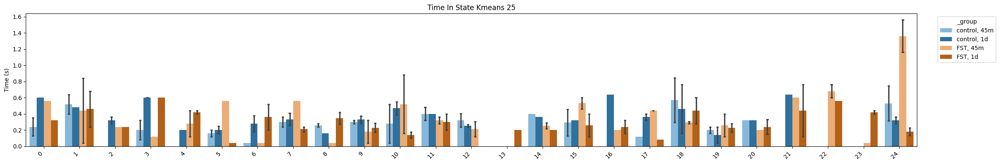

</div>

Even though the summary metric 'time_in_cluster' was created before grouping, the grouped plots 
work as expected with this summary metric (but the auto-generated title is different, because we
stored it with a manual name).

<div class="nb-cell-input" markdown>

```python
# Multi-component metric — 25 clusters × 4 groups
fig, ax, df_gbar = sc_grouped.snsbar(
    "time_in_cluster",
    group_order=GROUP_ORDER,
    show=True,
    savedir=str(OUT_DIR),
)
```

</div>

<div class="nb-cell-output nb-output-figure" markdown>

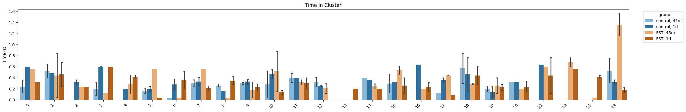

</div>

### 5.4 Statistical annotations

Use `annotate="help"` to discover available tests, corrections, and the
group labels in your data. Then pass `annotate={...}` with actual pairs.

<div class="nb-cell-input" markdown>

```python
# Discover labels and options (no annotation applied, just prints a guide)
fig_ann, ax_ann, df_ann = sc_grouped.snssuperplot(
    "total_distance_bodycentre",
    group_order=GROUP_ORDER,
    annotate="help",
    show=False,
)
```

</div>

<div class="nb-cell-output">
<pre><code>=== Statistical Annotation Guide ===

annotate={
    &quot;pairs&quot;: [(&quot;groupA&quot;, &quot;groupB&quot;), ...],  # REQUIRED
    &quot;test&quot;: &quot;Mann-Whitney&quot;,                # see below
    &quot;correction&quot;: None,                    # see below
    &quot;text_format&quot;: &quot;star&quot;,                 # &quot;star&quot;, &quot;simple&quot;, &quot;full&quot;
    &quot;headroom&quot;: None,                      # float multiplier, see below
}

Available tests:
  Parametric:     t-test_ind, t-test_welch, t-test_paired
  Non-parametric: Mann-Whitney, Wilcoxon, Kruskal, Brunner-Munzel
  Other:          Levene (variance equality)

  Tip: Mann-Whitney is a safe default for most behavioural data.
  Use paired tests (t-test_paired, Wilcoxon) for repeated measures.
  Use parametric tests only if data is normally distributed.

Multiple comparisons correction (recommended for &gt;3 pairs):
  FWER (conservative): bonferroni, holm
  FDR  (less conservative): fdr_bh (Benjamini-Hochberg), fdr_by

Headroom:
  Extra vertical space for brackets, as a fraction of the y range.
  E.g. headroom=0.3 adds 30%% extra room above the data.

Your labels: [&#x27;FST, 1d&#x27;, &#x27;FST, 45m&#x27;, &#x27;control, 1d&#x27;, &#x27;control, 45m&#x27;]</code></pre>
</div>

<div class="nb-cell-input" markdown>

```python
# Apply annotations
fig_ann, ax_ann, df_ann = sc_grouped.snsbox(
    "total_distance_bodycentre",
    group_order=GROUP_ORDER,
    annotate={
        "pairs": [("control, 45m", "FST, 45m"), ("control, 1d", "FST, 1d")],
        "test": "Mann-Whitney",
        "correction": None,
        "text_format": "star",
        "headroom": 0.0, # add extra space for annotations if needed
    },
    savedir=str(OUT_DIR),
    filename="total_distance_annotated_superplot.png",
    show=True,
)
```

</div>

<div class="nb-cell-output">
<pre><code>p-value annotation legend:
      ns: 5.00e-02 &lt; p &lt;= 1.00e+00
       *: 1.00e-02 &lt; p &lt;= 5.00e-02
      **: 1.00e-03 &lt; p &lt;= 1.00e-02
     ***: 1.00e-04 &lt; p &lt;= 1.00e-03
    ****: p &lt;= 1.00e-04

control, 45m vs. FST, 45m: Mann-Whitney-Wilcoxon test two-sided, P_val:3.939e-01 U_stat=1.200e+01
control, 1d vs. FST, 1d: Mann-Whitney-Wilcoxon test two-sided, P_val:4.113e-02 U_stat=3.100e+01</code></pre>
</div>

<div class="nb-cell-output nb-output-figure" markdown>

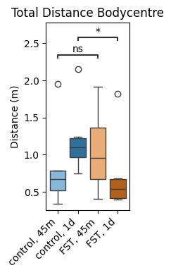

</div>

### 5.5 Metric input options

Two ways to pass a metric to any `sns*` method:

1. **String key** — a previously stored metric name
2. **SummaryResult** object — inline computation (not stored)
(Both of these may be either single component,  or multi-component)

<div class="nb-cell-input" markdown>

```python
# 1. String key
fig, ax, _ = sc.snsstrip("total_distance_bodycentre", show=False)

# 2. SummaryResult object (inline)
fig, ax, df_mc = sc.snsbar(
    sc.time_in_state("within_boundary_static_bodycentre_in_center"),
    show=False,
)
```

</div>

## 6. Behaviour Flow Analysis (BFA)

### 6.1 Compute BFA results and statistics

<div class="nb-cell-input" markdown>

```python
bfa_results = sc_grouped.bfa(column="kmeans_25", all_states=np.arange(0, N_CLUSTERS))
bfa_stats = p3b.SummaryCollection.bfa_stats(bfa_results)

with open(f"{OUT_DIR}/bfa_results.json", "w") as f:
    json.dump(bfa_results, f, indent=4)
with open(f"{OUT_DIR}/bfa_stats.json", "w") as f:
    json.dump(bfa_stats, f, indent=4)
```

</div>

### 6.2 BFA histograms

Distribution of shuffled transition values vs observed, per group comparison.

<div class="nb-cell-input" markdown>

```python
p3b.SummaryCollection.plot_bfa_results(
    bfa_results,
    add_stats=True,
    stats=bfa_stats,
    bins=20,
    figsize=(4, 3),
    save_dir=OUT_DIR,
    show=True,
)
```

</div>

<div class="nb-cell-output nb-output-figure" markdown>

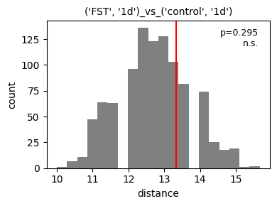

</div>

<div class="nb-cell-output nb-output-figure" markdown>

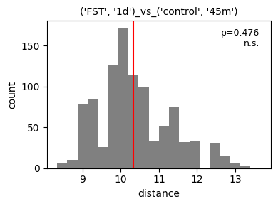

</div>

<div class="nb-cell-output nb-output-figure" markdown>

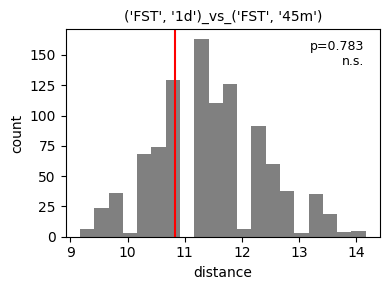

</div>

<div class="nb-cell-output nb-output-figure" markdown>

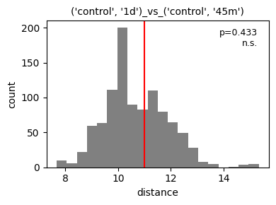

</div>

<div class="nb-cell-output nb-output-figure" markdown>

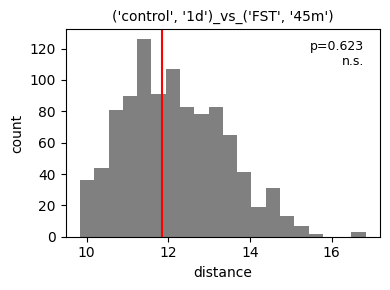

</div>

<div class="nb-cell-output nb-output-figure" markdown>

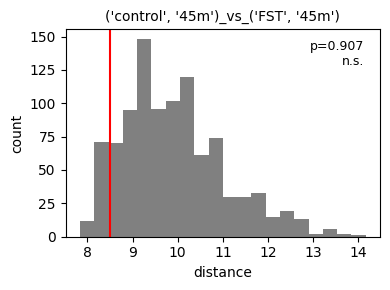

</div>

<div class="nb-cell-output">
<pre><code>{&quot;(&#x27;FST&#x27;, &#x27;1d&#x27;)_vs_(&#x27;control&#x27;, &#x27;1d&#x27;)&quot;: (&lt;Figure size 400x300 with 1 Axes&gt;,
  &lt;Axes: title={&#x27;center&#x27;: &quot;(&#x27;FST&#x27;, &#x27;1d&#x27;)_vs_(&#x27;control&#x27;, &#x27;1d&#x27;)&quot;}, xlabel=&#x27;distance&#x27;, ylabel=&#x27;count&#x27;&gt;),
 &quot;(&#x27;FST&#x27;, &#x27;1d&#x27;)_vs_(&#x27;control&#x27;, &#x27;45m&#x27;)&quot;: (&lt;Figure size 400x300 with 1 Axes&gt;,
  &lt;Axes: title={&#x27;center&#x27;: &quot;(&#x27;FST&#x27;, &#x27;1d&#x27;)_vs_(&#x27;control&#x27;, &#x27;45m&#x27;)&quot;}, xlabel=&#x27;distance&#x27;, ylabel=&#x27;count&#x27;&gt;),
 &quot;(&#x27;FST&#x27;, &#x27;1d&#x27;)_vs_(&#x27;FST&#x27;, &#x27;45m&#x27;)&quot;: (&lt;Figure size 400x300 with 1 Axes&gt;,
  &lt;Axes: title={&#x27;center&#x27;: &quot;(&#x27;FST&#x27;, &#x27;1d&#x27;)_vs_(&#x27;FST&#x27;, &#x27;45m&#x27;)&quot;}, xlabel=&#x27;distance&#x27;, ylabel=&#x27;count&#x27;&gt;),
 &quot;(&#x27;control&#x27;, &#x27;1d&#x27;)_vs_(&#x27;control&#x27;, &#x27;45m&#x27;)&quot;: (&lt;Figure size 400x300 with 1 Axes&gt;,
  &lt;Axes: title={&#x27;center&#x27;: &quot;(&#x27;control&#x27;, &#x27;1d&#x27;)_vs_(&#x27;control&#x27;, &#x27;45m&#x27;)&quot;}, xlabel=&#x27;distance&#x27;, ylabel=&#x27;count&#x27;&gt;),
 &quot;(&#x27;control&#x27;, &#x27;1d&#x27;)_vs_(&#x27;FST&#x27;, &#x27;45m&#x27;)&quot;: (&lt;Figure size 400x300 with 1 Axes&gt;,
  &lt;Axes: title={&#x27;center&#x27;: &quot;(&#x27;control&#x27;, &#x27;1d&#x27;)_vs_(&#x27;FST&#x27;, &#x27;45m&#x27;)&quot;}, xlabel=&#x27;distance&#x27;, ylabel=&#x27;count&#x27;&gt;),
 &quot;(&#x27;control&#x27;, &#x27;45m&#x27;)_vs_(&#x27;FST&#x27;, &#x27;45m&#x27;)&quot;: (&lt;Figure size 400x300 with 1 Axes&gt;,
  &lt;Axes: title={&#x27;center&#x27;: &quot;(&#x27;control&#x27;, &#x27;45m&#x27;)_vs_(&#x27;FST&#x27;, &#x27;45m&#x27;)&quot;}, xlabel=&#x27;distance&#x27;, ylabel=&#x27;count&#x27;&gt;)}</code></pre>
</div>

### 6.3 Chord diagrams

Requires `pycirclize` — install with `pip install py3r-behaviour[viz]`.

<div class="nb-cell-input" markdown>

```python
if not SKIP_HEAVY_VIZ:
    sc_grouped.plot_chord(
        column="kmeans_25",
        all_states=np.arange(0, N_CLUSTERS),
        save_dir=OUT_DIR,
        show=True,
        start=-265,
        end=95,
        space=5,
        r_lim=(93, 100),
        label_kws=dict(r=94, size=12, color="white"),
        link_kws=dict(ec="black", lw=0.5),
    )
```

</div>

<div class="nb-cell-output nb-output-figure" markdown>

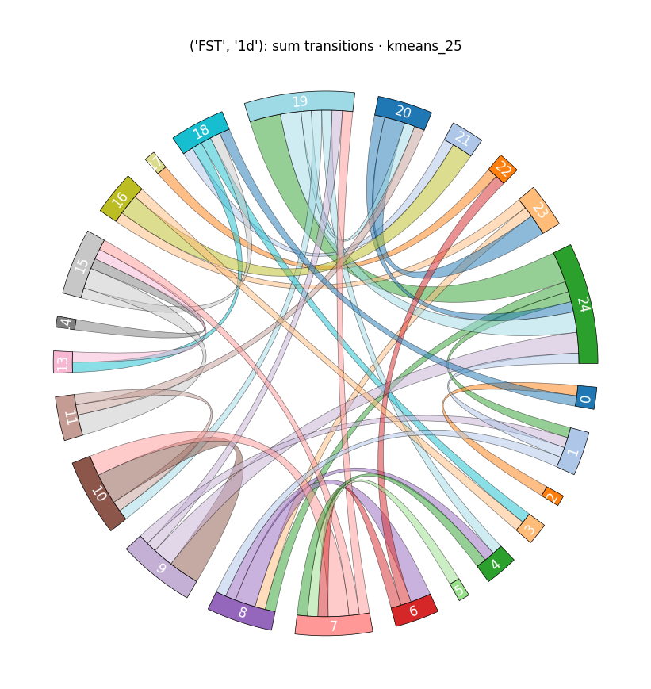

</div>

<div class="nb-cell-output nb-output-figure" markdown>

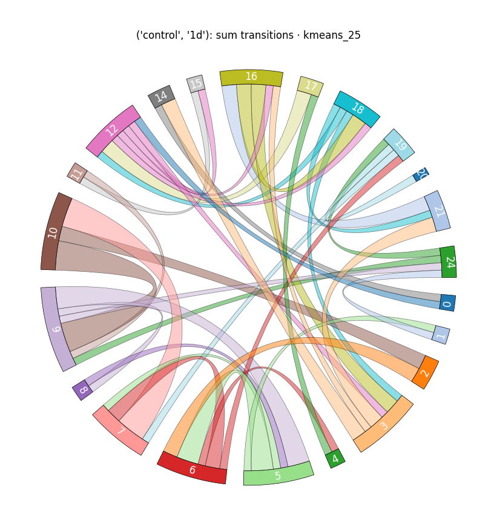

</div>

<div class="nb-cell-output nb-output-figure" markdown>

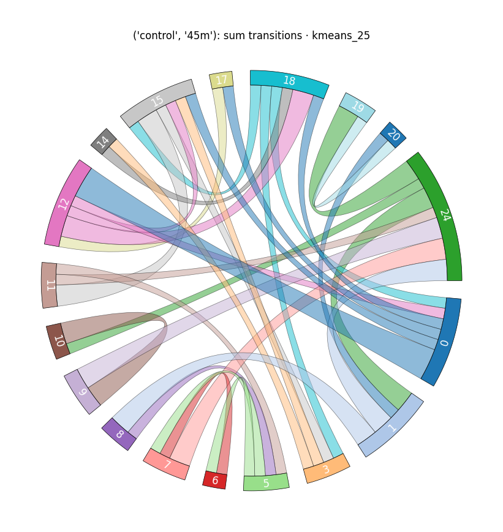

</div>

<div class="nb-cell-output nb-output-figure" markdown>

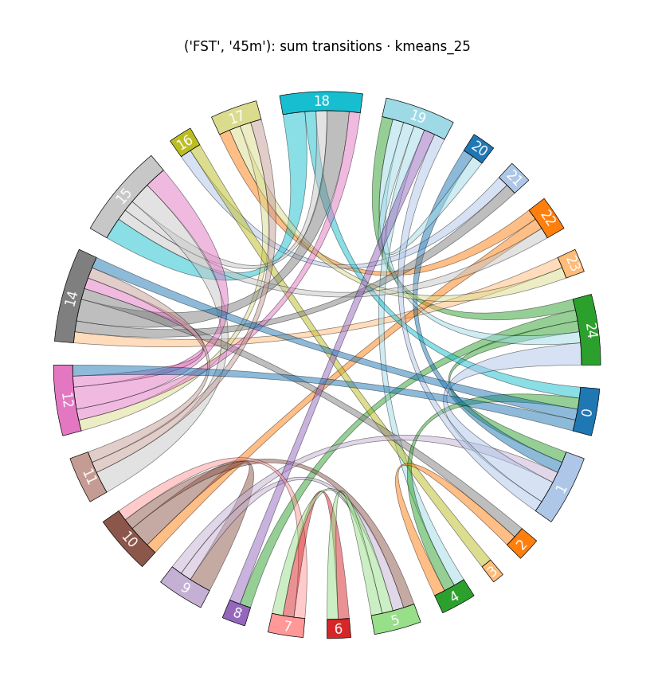

</div>

### 6.4 UMAP embedding of transition matrices

Requires `umap-learn` — install with `pip install py3r-behaviour[viz]`.

<div class="nb-cell-input" markdown>

```python
if not SKIP_HEAVY_VIZ:
    fig, ax = sc_grouped.plot_transition_umap(
        column="kmeans_25",
        all_states=np.arange(0, N_CLUSTERS),
        n_neighbors=15,
        min_dist=0.1,
        random_state=42,
        figsize=(6, 5),
        show=True,
        save_dir=str(OUT_DIR),
    )
```

</div>

<div class="nb-cell-output">
<pre><code>/Users/work/Documents/GitHub/py3r_behaviour/.venv/lib/python3.12/site-packages/tqdm/auto.py:21: TqdmWarning: IProgress not found. Please update jupyter and ipywidgets. See https://ipywidgets.readthedocs.io/en/stable/user_install.html
  from .autonotebook import tqdm as notebook_tqdm</code></pre>
</div>

<div class="nb-cell-output">
<pre><code>/Users/work/Documents/GitHub/py3r_behaviour/.venv/lib/python3.12/site-packages/umap/umap_.py:1952: UserWarning: n_jobs value 1 overridden to 1 by setting random_state. Use no seed for parallelism.
  warn(</code></pre>
</div>

<div class="nb-cell-output nb-output-figure" markdown>


</div>

## Done
