<!-- AUTO-GENERATED by tools/render_notebooks.py — do not edit manually -->

!!! example "Run this example yourself"
    [Download the oft_pipeline example](https://github.com/ETHZ-3Rhub/py3r_behaviour/releases/latest/download/oft_pipeline.zip) — unzip and open `oft_pipeline.ipynb` in Jupyter.

# Open Field Test (OFT) — Full analysis pipeline example

## Setup

<div class="nb-cell-input" markdown>

```python
import json
import os
from pathlib import Path

import numpy as np
import pandas as pd

import py3r.behaviour as p3b

try:
    from IPython.display import display
except ImportError:

    def display(x):
        print(x)


# Skip heavy visualisation deps (pycirclize, umap-learn) in CI
SKIP_HEAVY_VIZ = os.environ.get("CI", "").lower() in ("true", "1", "yes")

# Paths
DATA_DIR = Path("data/tracking")
TAGS_CSV = Path("data/tags.csv")

OUT_DIR = Path(os.environ.get("NB_OUT_DIR", Path.cwd() / "_artifacts"))
OUT_DIR.mkdir(parents=True, exist_ok=True)

# Constants
FPS = 30
N_CLUSTERS = 25
```

</div>

## Load & Preprocess

### Load tracking data

Load a `TrackingCollection` from a folder of DeepLabCut CSV files.
Each CSV becomes one `Tracking` object keyed by its filename stem.
The provided `fps` is written into each leaf's metadata for downstream methods.
Return type here is `TrackingCollection`.
Alternative loaders with the same pattern: `from_yolo3r_folder`, `from_dlcma_folder`.

<div class="nb-cell-input" markdown>

```python
tc = p3b.TrackingCollection.from_dlc_folder(
    folder_path=DATA_DIR,
    fps=FPS,
)
print(tc)
# Main object types in `py3r.behaviour` implement `.copy()`.
# We'll keep an untouched copy for didactic examples in this notebook.
tc_raw_for_demo = tc.copy()
```

</div>

<div class="nb-cell-output">
<pre><code>&lt;TrackingCollection with 56 Tracking objects&gt;</code></pre>
</div>

All Collection objects, like `TrackingCollection`, implement `stored_info()`
to give a quick overview of their accessible contents

<div class="nb-cell-input" markdown>

```python
tc.stored_info()
```

</div>

<div class="nb-cell-output nb-output-table">
<div>
<style scoped>
    .dataframe tbody tr th:only-of-type {
        vertical-align: middle;
    }

    .dataframe tbody tr th {
        vertical-align: top;
    }

    .dataframe thead th {
        text-align: right;
    }
</style>
<table border="1" class="dataframe">
  <thead>
    <tr style="text-align: right;">
      <th></th>
      <th>attached_to</th>
      <th>missing_from</th>
      <th>dims</th>
    </tr>
    <tr>
      <th>point_name</th>
      <th></th>
      <th></th>
      <th></th>
    </tr>
  </thead>
  <tbody>
    <tr>
      <th>bcl</th>
      <td>56</td>
      <td>0</td>
      <td>[x, y]</td>
    </tr>
    <tr>
      <th>bcr</th>
      <td>56</td>
      <td>0</td>
      <td>[x, y]</td>
    </tr>
    <tr>
      <th>bl</th>
      <td>56</td>
      <td>0</td>
      <td>[x, y]</td>
    </tr>
    <tr>
      <th>bodycentre</th>
      <td>56</td>
      <td>0</td>
      <td>[x, y]</td>
    </tr>
    <tr>
      <th>br</th>
      <td>56</td>
      <td>0</td>
      <td>[x, y]</td>
    </tr>
    <tr>
      <th>earl</th>
      <td>56</td>
      <td>0</td>
      <td>[x, y]</td>
    </tr>
    <tr>
      <th>earr</th>
      <td>56</td>
      <td>0</td>
      <td>[x, y]</td>
    </tr>
    <tr>
      <th>headcentre</th>
      <td>56</td>
      <td>0</td>
      <td>[x, y]</td>
    </tr>
    <tr>
      <th>hipl</th>
      <td>56</td>
      <td>0</td>
      <td>[x, y]</td>
    </tr>
    <tr>
      <th>hipr</th>
      <td>56</td>
      <td>0</td>
      <td>[x, y]</td>
    </tr>
    <tr>
      <th>neck</th>
      <td>56</td>
      <td>0</td>
      <td>[x, y]</td>
    </tr>
    <tr>
      <th>nose</th>
      <td>56</td>
      <td>0</td>
      <td>[x, y]</td>
    </tr>
    <tr>
      <th>tailbase</th>
      <td>56</td>
      <td>0</td>
      <td>[x, y]</td>
    </tr>
    <tr>
      <th>tailcentre</th>
      <td>56</td>
      <td>0</td>
      <td>[x, y]</td>
    </tr>
    <tr>
      <th>tailtip</th>
      <td>56</td>
      <td>0</td>
      <td>[x, y]</td>
    </tr>
    <tr>
      <th>tl</th>
      <td>56</td>
      <td>0</td>
      <td>[x, y]</td>
    </tr>
    <tr>
      <th>tr</th>
      <td>56</td>
      <td>0</td>
      <td>[x, y]</td>
    </tr>
  </tbody>
</table>
</div>
</div>

### Add experimental tags

A tags CSV maps recording handles to experimental metadata.
It must contain a `handle` column matching filename stems;
every other column becomes a tag key–value pair.
`tags_info()` is a quick schema check: coverage and cardinality per tag.
`add_tags_from_csv(...)` mutates each `Tracking` in-place and returns `None`.

<div class="nb-cell-input" markdown>

```python
tc.add_tags_from_csv(csv_path=TAGS_CSV)
tc.tags_info()
```

</div>

<div class="nb-cell-output">
<pre><code>added 168 tags to 56 elements in collection.</code></pre>
</div>

<div class="nb-cell-output nb-output-table">
<div>
<style scoped>
    .dataframe tbody tr th:only-of-type {
        vertical-align: middle;
    }

    .dataframe tbody tr th {
        vertical-align: top;
    }

    .dataframe thead th {
        text-align: right;
    }
</style>
<table border="1" class="dataframe">
  <thead>
    <tr style="text-align: right;">
      <th></th>
      <th>attached_to</th>
      <th>missing_from</th>
      <th>unique_values</th>
    </tr>
    <tr>
      <th>tag</th>
      <th></th>
      <th></th>
      <th></th>
    </tr>
  </thead>
  <tbody>
    <tr>
      <th>sex</th>
      <td>56</td>
      <td>0</td>
      <td>2</td>
    </tr>
    <tr>
      <th>timepoint</th>
      <td>56</td>
      <td>0</td>
      <td>2</td>
    </tr>
    <tr>
      <th>treatment</th>
      <td>56</td>
      <td>0</td>
      <td>2</td>
    </tr>
  </tbody>
</table>
</div>
</div>

### Didactic: batch processing

With a `TrackingCollection`, `.each` delegates calls to each `Tracking`.
Think "batch call the same `Tracking` method for all recordings".
This `.each` batch processing pattern also applies to `FeaturesCollection`
and `SummaryCollection`, as we will see later.

Methods on `Tracking` are `inplace=True` by default, so `.each` returns a
`BatchResult`. If `inplace=False`, `.each` returns a `TrackingCollection`.

Passing a `BatchResult` back into `.each` maps values by handle.

<div class="nb-cell-input" markdown>

```python
demo_inplace = tc_raw_for_demo.copy().each.filter_likelihood(threshold=0.9)
demo_new_collection = tc_raw_for_demo.copy().each.filter_likelihood(
    threshold=0.9,
    inplace=False,
)
print(type(demo_inplace).__name__)  # expected: BatchResult
print(type(demo_new_collection).__name__)  # expected: TrackingCollection
```

</div>

<div class="nb-cell-output">
<pre><code>BatchResult
TrackingCollection</code></pre>
</div>

### Preprocess

Standard preprocessing chain: remove low-confidence detections,
interpolate short gaps, smooth trajectories, and rescale coordinates
to real-world units.
This order is intentional: filter -> interpolate -> smooth -> rescale.

In this main path we use in-place behaviour (typical analysis workflow).
Equivalent non-in-place variants are shown above in the didactic batch section.

<div class="nb-cell-input" markdown>

```python
tc.each.filter_likelihood(threshold=0.9)
tc.each.interpolate(limit=5)
tc.each.smooth_all(window=3, method="mean")
tc.each.rescale_by_known_distance(
    point1="tl",
    point2="br",
    distance_in_metres=0.64,
)
```

</div>

<div class="nb-cell-output">
<pre><code>BatchResult: 56 items processed (in-place)</code></pre>
</div>

### Re-running preprocessing

Most preprocessing methods guard against re-application. For parameter tuning,
prefer `inplace=False` and work on a copy.

<div class="nb-cell-input" markdown>

```python
try:
    tc.each.interpolate(limit=5)
except Exception as e:
    print(e)
```

</div>

<div class="nb-cell-output">
<pre><code>Error in collection &#x27;None&#x27;, object &#x27;OFT2_11&#x27;, method &#x27;interpolate&#x27;: data already interpolated. re-load the raw data to interpolate again</code></pre>
</div>

### Quality check — trajectory plots

Save trajectory plots for every recording and display one inline for QC.
Pattern used here:
- batch save all (`tc.each.plot(..., savedir=...)`)
- inspect one representative recording inline (`tc[0].plot(...)`)

<div class="nb-cell-input" markdown>

```python
trajectories = ["bodycentre"]
static = ["tl", "tr", "bl", "br"]
lines = [("tr", "tl"), ("tl", "bl"), ("bl", "br"), ("br", "tr")]

tc.each.plot(trajectories=trajectories, static=static, lines=lines, show=False, savedir=OUT_DIR)

# Single inline plot for visual QC
tc[0].plot(trajectories=trajectories, static=static, lines=lines, show=True)
```

</div>

<div class="nb-cell-output nb-output-figure" markdown>

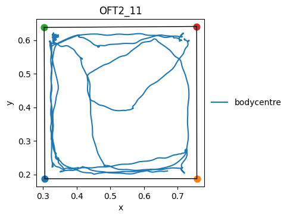

</div>

<div class="nb-cell-output">
<pre><code>(&lt;Figure size 500x500 with 1 Axes&gt;,
 &lt;Axes: title={&#x27;center&#x27;: &#x27;OFT2_11&#x27;}, xlabel=&#x27;x&#x27;, ylabel=&#x27;y&#x27;&gt;)</code></pre>
</div>

## Compute Features

### Create FeaturesCollection

A `FeaturesCollection` wraps every recording's tracking data with
methods for computing time-series features.
Most feature methods return `FeaturesResult`; call `.store()` to persist
to `Features.data` and register metadata in `Features.meta`.

`tc.to_features()` is the preferred shorthand for
`FeaturesCollection.from_tracking_collection(tc)` and preserves any
grouped structure on the collection.

<div class="nb-cell-input" markdown>

```python
fc = tc.to_features()
```

</div>

### Spatial features — boundaries

Define/store named boundaries on each `Features` leaf, then use either:
- mapped `BatchResult` boundary objects (smart per-handle passthrough), or
- boundary names (resolved from stored per-recording assets).
Here we use both and assert they match.

<div class="nb-cell-input" markdown>

```python
ordered_oft_corners = ["tl", "tr", "br", "bl"]
```

</div>

Define and store a centre boundary for each recording.

<div class="nb-cell-input" markdown>

```python
centre_boundary = fc.each.define_static_boundary(
    ordered_oft_corners,
    scale_dim1=0.5,
    scale_dim2=0.5,
    name="centre",
)
```

</div>

Compare boundary usage styles: pass boundary objects vs stored boundary names.

<div class="nb-cell-input" markdown>

```python
in_centre = fc.each.within_boundary(point="bodycentre", boundary=centre_boundary)
in_centre_by_name = fc.each.within_boundary(point="bodycentre", boundary="centre")
for handle in fc.keys():
    assert in_centre[handle].equals(in_centre_by_name[handle])
```

</div>

Store the result. Without a manual name, an automatic descriptive name is used.
`.store` always returns the stored name

<div class="nb-cell-input" markdown>

```python
in_centre.store()
```

</div>

<div class="nb-cell-output">
<pre><code>&#x27;within_boundary_static_bodycentre_in_centre&#x27;</code></pre>
</div>

`BatchResult` supports logical composition (for example, arena periphery).

<div class="nb-cell-input" markdown>

```python
_ = fc.each.define_static_boundary(
    ordered_oft_corners,
    scale_dim1=0.8,
    scale_dim2=0.8,
    name="not_periphery",
)
_ = fc.each.define_static_boundary(
    ordered_oft_corners,
    name="oft",
)
(
    fc.each.within_boundary("bodycentre", "oft")
    & (~fc.each.within_boundary("bodycentre", "not_periphery"))
).store("in_periphery")
```

</div>

<div class="nb-cell-output">
<pre><code>&#x27;in_periphery&#x27;</code></pre>
</div>

Corner occupancy can be represented as a single state feature instead of many
independent booleans.

<div class="nb-cell-input" markdown>

```python
in_corners = dict()
for c in ordered_oft_corners:
    _ = fc.each.define_static_boundary(
        ordered_oft_corners,
        scale_dim1=0.2,
        scale_dim2=0.2,
        name=f"{c}_corner",
        anchor=c,
    )
    in_corners[c] = fc.each.within_boundary("bodycentre", boundary=f"{c}_corner")
```

</div>

<div class="nb-cell-input" markdown>

```python
# Store a convenience boolean for "in any corner".
(in_corners["tl"] | in_corners["tr"] | in_corners["bl"] | in_corners["br"]).store("in_corner")
```

</div>

<div class="nb-cell-output">
<pre><code>&#x27;in_corner&#x27;</code></pre>
</div>

<div class="nb-cell-input" markdown>

```python
# Store a categorical corner-state feature for state-based analyses.
fc.each.compose_state_from_booleans(in_corners).store("corner_state")
```

</div>

<div class="nb-cell-output">
<pre><code>&#x27;corner_state&#x27;</code></pre>
</div>

<div class="nb-cell-input" markdown>

```python
# Keep these existing columns out of clustering feature selection.
non_bfa_feats = fc[0].data.columns
```

</div>

`BatchResult` also supports element-wise arithmetic across handles.

<div class="nb-cell-input" markdown>

```python
dist_change = fc.each.distance_change("bodycentre")
dist_change_in_centre = in_centre.astype("Int64") * dist_change
dist_change_in_centre.store(name="dist_change_bodycentre_in_centre")
```

</div>

<div class="nb-cell-output">
<pre><code>&#x27;dist_change_bodycentre_in_centre&#x27;</code></pre>
</div>

<div class="nb-cell-input" markdown>

```python
# `BatchResult` also supports general binary operations.
fast_outside_centre = ~in_centre & ((fc.each.speed("bodycentre") * 100) > 10.0)
# This is an example only; we do not store it.
```

</div>

### Kinematic features for BFA

Speeds, angle deviations, inter-keypoint distances, body-part areas,
and distance to the arena boundary — the standard feature set for
behavioural flow analysis clustering.
The loop pattern below intentionally stores each feature as a named column,
so later clustering/summary code can reference columns deterministically.

Specific choices used here:
- For kinematic polygons, we define named dynamic boundaries, then compute
  dynamic area (`median=False`) over their ordered points.
- For arena distance, we define named static boundaries and loop over points.

<div class="nb-cell-input" markdown>

```python
# Speeds
for pt in ["nose", "neck", "earr", "earl", "bodycentre", "hipl", "hipr", "tailbase"]:
    fc.each.speed(pt).store()
```

</div>

Compute angular features.

<div class="nb-cell-input" markdown>

```python
# Angle deviations
for basepoint, pointdirection1, pointdirection2 in [
    ("tailbase", "hipr", "hipl"),
    ("bodycentre", "tailbase", "neck"),
    ("neck", "bodycentre", "headcentre"),
    ("headcentre", "earr", "earl"),
]:
    fc.each.azimuth_deviation(basepoint, pointdirection1, pointdirection2).store()
```

</div>

Compute inter-keypoint distances.

<div class="nb-cell-input" markdown>

```python
# Inter-keypoint distances
for p1, p2 in [
    ("nose", "headcentre"),
    ("neck", "headcentre"),
    ("neck", "bodycentre"),
    ("bcr", "bodycentre"),
    ("bcl", "bodycentre"),
    ("tailbase", "bodycentre"),
    ("tailbase", "hipr"),
    ("tailbase", "hipl"),
    ("bcr", "hipr"),
    ("bcl", "hipl"),
    ("bcl", "earl"),
    ("bcr", "earr"),
    ("nose", "earr"),
    ("nose", "earl"),
]:
    fc.each.distance_between(p1, p2).store()
```

</div>

Define dynamic body boundaries and store per-boundary area features.

<div class="nb-cell-input" markdown>

```python
DYNAMIC_BODY_BOUNDARIES = [
    ("mouse_rear", ["tailbase", "hipr", "hipl"]),
    ("mouse_mid", ["hipr", "hipl", "bcl", "bcr"]),
    ("mouse_front", ["bcr", "earr", "earl", "bcl"]),
    ("mouse_face", ["earr", "nose", "earl"]),
]

for boundary_name, boundary_points in DYNAMIC_BODY_BOUNDARIES:
    fc.each.define_dynamic_boundary(boundary_points, name=boundary_name)
    fc.each.area_of_boundary(boundary_name).store()
```

</div>

Compute distance-to-boundary features for selected points.

<div class="nb-cell-input" markdown>

```python
STATIC_DISTANCE_TO_BOUNDARY_POINTS = ["nose", "neck", "bodycentre", "tailbase"]

for pt in STATIC_DISTANCE_TO_BOUNDARY_POINTS:
    fc.each.distance_to_boundary(pt, "oft").store()
```

</div>

Inspect stored boundary assets on one recording.

<div class="nb-cell-input" markdown>

```python
fc[0].list_boundaries()
```

</div>

<div class="nb-cell-output nb-output-table">
<div>
<style scoped>
    .dataframe tbody tr th:only-of-type {
        vertical-align: middle;
    }

    .dataframe tbody tr th {
        vertical-align: top;
    }

    .dataframe thead th {
        text-align: right;
    }
</style>
<table border="1" class="dataframe">
  <thead>
    <tr style="text-align: right;">
      <th></th>
      <th>kind</th>
      <th>n_points</th>
      <th>has_vertices</th>
    </tr>
    <tr>
      <th>name</th>
      <th></th>
      <th></th>
      <th></th>
    </tr>
  </thead>
  <tbody>
    <tr>
      <th>centre</th>
      <td>static</td>
      <td>4</td>
      <td>True</td>
    </tr>
    <tr>
      <th>not_periphery</th>
      <td>static</td>
      <td>4</td>
      <td>True</td>
    </tr>
    <tr>
      <th>oft</th>
      <td>static</td>
      <td>4</td>
      <td>True</td>
    </tr>
    <tr>
      <th>tl_corner</th>
      <td>static</td>
      <td>4</td>
      <td>True</td>
    </tr>
    <tr>
      <th>tr_corner</th>
      <td>static</td>
      <td>4</td>
      <td>True</td>
    </tr>
    <tr>
      <th>br_corner</th>
      <td>static</td>
      <td>4</td>
      <td>True</td>
    </tr>
    <tr>
      <th>bl_corner</th>
      <td>static</td>
      <td>4</td>
      <td>True</td>
    </tr>
    <tr>
      <th>mouse_rear</th>
      <td>dynamic</td>
      <td>3</td>
      <td>False</td>
    </tr>
    <tr>
      <th>mouse_mid</th>
      <td>dynamic</td>
      <td>4</td>
      <td>False</td>
    </tr>
    <tr>
      <th>mouse_front</th>
      <td>dynamic</td>
      <td>4</td>
      <td>False</td>
    </tr>
    <tr>
      <th>mouse_face</th>
      <td>dynamic</td>
      <td>3</td>
      <td>False</td>
    </tr>
  </tbody>
</table>
</div>
</div>

### K-means clustering

Embed the feature time-series with temporal offsets, then cluster the embedded
space with streaming MiniBatchKMeans.
Returns `(cluster_labels, centroids)`, where:
- `cluster_labels` is a per-handle `BatchResult` of label series
- `centroids` is a `CentroidsDf` with `n_clusters` rows; its `scaling_recipe`
  captures the full transform (embedding, normalisation, imputation means) so
  that `assign_clusters_by_centroids` can reproduce it exactly on new data

`cluster_embedding_stream` processes one `Features` at a time in multiple epochs
so it never materialises a combined DataFrame — use this for any multi-recording
dataset. Supports `normalize`, `normalize_details`, and `feature_weights`.

<div class="nb-cell-input" markdown>

```python
cluster_features = list(set(fc[0].data.columns) - set(non_bfa_feats))
offset = list(np.arange(-15, 16, 1))
embedding_dict = {f: offset for f in cluster_features}

cluster_labels, centroids = fc.cluster_embedding_stream(
    embedding_dict=embedding_dict, n_clusters=N_CLUSTERS
)
cluster_labels.store("kmeans_25", overwrite=True)
```

</div>

<div class="nb-cell-output">
<pre><code>&#x27;kmeans_25&#x27;</code></pre>
</div>

<div class="nb-cell-input" markdown>

```python
# A quick overview of the stored features
```

</div>

<div class="nb-cell-input" markdown>

```python
fc.stored_info()
```

</div>

<div class="nb-cell-output nb-output-table">
<div>
<style scoped>
    .dataframe tbody tr th:only-of-type {
        vertical-align: middle;
    }

    .dataframe tbody tr th {
        vertical-align: top;
    }

    .dataframe thead th {
        text-align: right;
    }
</style>
<table border="1" class="dataframe">
  <thead>
    <tr style="text-align: right;">
      <th></th>
      <th>attached_to</th>
      <th>missing_from</th>
      <th>type</th>
    </tr>
    <tr>
      <th>feature</th>
      <th></th>
      <th></th>
      <th></th>
    </tr>
  </thead>
  <tbody>
    <tr>
      <th>area_of_boundary_mouse_face_dynamic</th>
      <td>56</td>
      <td>0</td>
      <td>float64</td>
    </tr>
    <tr>
      <th>area_of_boundary_mouse_front_dynamic</th>
      <td>56</td>
      <td>0</td>
      <td>float64</td>
    </tr>
    <tr>
      <th>area_of_boundary_mouse_mid_dynamic</th>
      <td>56</td>
      <td>0</td>
      <td>float64</td>
    </tr>
    <tr>
      <th>area_of_boundary_mouse_rear_dynamic</th>
      <td>56</td>
      <td>0</td>
      <td>float64</td>
    </tr>
    <tr>
      <th>azimuth_deviation_bodycentre_to_tailbase_and_neck</th>
      <td>56</td>
      <td>0</td>
      <td>float64</td>
    </tr>
    <tr>
      <th>azimuth_deviation_headcentre_to_earr_and_earl</th>
      <td>56</td>
      <td>0</td>
      <td>float64</td>
    </tr>
    <tr>
      <th>azimuth_deviation_neck_to_bodycentre_and_headcentre</th>
      <td>56</td>
      <td>0</td>
      <td>float64</td>
    </tr>
    <tr>
      <th>azimuth_deviation_tailbase_to_hipr_and_hipl</th>
      <td>56</td>
      <td>0</td>
      <td>float64</td>
    </tr>
    <tr>
      <th>corner_state</th>
      <td>56</td>
      <td>0</td>
      <td>object</td>
    </tr>
    <tr>
      <th>dist_change_bodycentre_in_centre</th>
      <td>56</td>
      <td>0</td>
      <td>Float64</td>
    </tr>
    <tr>
      <th>distance_between_bcl_and_bodycentre_in_xy</th>
      <td>56</td>
      <td>0</td>
      <td>float64</td>
    </tr>
    <tr>
      <th>distance_between_bcl_and_earl_in_xy</th>
      <td>56</td>
      <td>0</td>
      <td>float64</td>
    </tr>
    <tr>
      <th>distance_between_bcl_and_hipl_in_xy</th>
      <td>56</td>
      <td>0</td>
      <td>float64</td>
    </tr>
    <tr>
      <th>distance_between_bcr_and_bodycentre_in_xy</th>
      <td>56</td>
      <td>0</td>
      <td>float64</td>
    </tr>
    <tr>
      <th>distance_between_bcr_and_earr_in_xy</th>
      <td>56</td>
      <td>0</td>
      <td>float64</td>
    </tr>
    <tr>
      <th>distance_between_bcr_and_hipr_in_xy</th>
      <td>56</td>
      <td>0</td>
      <td>float64</td>
    </tr>
    <tr>
      <th>distance_between_neck_and_bodycentre_in_xy</th>
      <td>56</td>
      <td>0</td>
      <td>float64</td>
    </tr>
    <tr>
      <th>distance_between_neck_and_headcentre_in_xy</th>
      <td>56</td>
      <td>0</td>
      <td>float64</td>
    </tr>
    <tr>
      <th>distance_between_nose_and_earl_in_xy</th>
      <td>56</td>
      <td>0</td>
      <td>float64</td>
    </tr>
    <tr>
      <th>distance_between_nose_and_earr_in_xy</th>
      <td>56</td>
      <td>0</td>
      <td>float64</td>
    </tr>
    <tr>
      <th>distance_between_nose_and_headcentre_in_xy</th>
      <td>56</td>
      <td>0</td>
      <td>float64</td>
    </tr>
    <tr>
      <th>distance_between_tailbase_and_bodycentre_in_xy</th>
      <td>56</td>
      <td>0</td>
      <td>float64</td>
    </tr>
    <tr>
      <th>distance_between_tailbase_and_hipl_in_xy</th>
      <td>56</td>
      <td>0</td>
      <td>float64</td>
    </tr>
    <tr>
      <th>distance_between_tailbase_and_hipr_in_xy</th>
      <td>56</td>
      <td>0</td>
      <td>float64</td>
    </tr>
    <tr>
      <th>distance_to_boundary_static_bodycentre_in_oft</th>
      <td>56</td>
      <td>0</td>
      <td>float64</td>
    </tr>
    <tr>
      <th>distance_to_boundary_static_neck_in_oft</th>
      <td>56</td>
      <td>0</td>
      <td>float64</td>
    </tr>
    <tr>
      <th>distance_to_boundary_static_nose_in_oft</th>
      <td>56</td>
      <td>0</td>
      <td>float64</td>
    </tr>
    <tr>
      <th>distance_to_boundary_static_tailbase_in_oft</th>
      <td>56</td>
      <td>0</td>
      <td>float64</td>
    </tr>
    <tr>
      <th>in_corner</th>
      <td>56</td>
      <td>0</td>
      <td>boolean</td>
    </tr>
    <tr>
      <th>in_periphery</th>
      <td>56</td>
      <td>0</td>
      <td>boolean</td>
    </tr>
    <tr>
      <th>kmeans_25</th>
      <td>56</td>
      <td>0</td>
      <td>Int64</td>
    </tr>
    <tr>
      <th>speed_of_bodycentre_in_xy</th>
      <td>56</td>
      <td>0</td>
      <td>float64</td>
    </tr>
    <tr>
      <th>speed_of_earl_in_xy</th>
      <td>56</td>
      <td>0</td>
      <td>float64</td>
    </tr>
    <tr>
      <th>speed_of_earr_in_xy</th>
      <td>56</td>
      <td>0</td>
      <td>float64</td>
    </tr>
    <tr>
      <th>speed_of_hipl_in_xy</th>
      <td>56</td>
      <td>0</td>
      <td>float64</td>
    </tr>
    <tr>
      <th>speed_of_hipr_in_xy</th>
      <td>56</td>
      <td>0</td>
      <td>float64</td>
    </tr>
    <tr>
      <th>speed_of_neck_in_xy</th>
      <td>56</td>
      <td>0</td>
      <td>float64</td>
    </tr>
    <tr>
      <th>speed_of_nose_in_xy</th>
      <td>56</td>
      <td>0</td>
      <td>float64</td>
    </tr>
    <tr>
      <th>speed_of_tailbase_in_xy</th>
      <td>56</td>
      <td>0</td>
      <td>float64</td>
    </tr>
    <tr>
      <th>within_boundary_static_bodycentre_in_centre</th>
      <td>56</td>
      <td>0</td>
      <td>boolean</td>
    </tr>
  </tbody>
</table>
</div>
</div>

### Save features to disk

`save()` writes a collection manifest plus per-handle element folders.
This makes downstream loading deterministic and auditable.
Later you can reconstruct with `p3b.FeaturesCollection.load(path)`.

<div class="nb-cell-input" markdown>

```python
fc.save(f"{OUT_DIR}/features", data_format="csv", overwrite=True)
```

</div>

## Summarise

### Create SummaryCollection

Each `Summary` object holds scalar (or Series) metrics computed from
a single recording's features.

`fc.to_summary()` is the preferred shorthand for
`SummaryCollection.from_features_collection(fc)` and preserves any
grouped structure on the collection.

<div class="nb-cell-input" markdown>

```python
sc = fc.to_summary()
```

</div>

### Compute summary measures

Call summary methods and `.store()` the result to persist it.
Stored summary metrics become scalar columns in each `Summary.data` record.

Same pattern as features:
- compute result (`sc.total_distance(...)`, etc.)
- then `.store(...)` to persist by metric name.

<div class="nb-cell-input" markdown>

```python
sc.each.total_distance("bodycentre").store()
sc.each.time_true("within_boundary_static_bodycentre_in_centre").store("time_in_centre")
sc.each.sum_column("dist_change_bodycentre_in_centre").store(name="distance_moved_in_centre")

# by_state API example: average speed by composed spatial zone.
sc.each.by_state(
    "corner_state",
    all_states=ordered_oft_corners,
).mean_column("speed_of_bodycentre_in_xy").store("mean_speed_corners")

# by_state + all_states API example: force explicit cluster domain (0-9),
# including states absent in a recording.
sc.each.by_state("kmeans_25", all_states=[0, 1, 2, 3, 4, 5, 6, 7, 8, 9]).mean_column(
    "speed_of_bodycentre_in_xy"
).store("mean_speed_bodycentre_by_kmeans_25")
```

</div>

<div class="nb-cell-output">
<pre><code>&#x27;mean_speed_bodycentre_by_kmeans_25&#x27;</code></pre>
</div>

A quick overview of the stored summaries

<div class="nb-cell-input" markdown>

```python
sc.stored_info()
```

</div>

<div class="nb-cell-output nb-output-table">
<div>
<style scoped>
    .dataframe tbody tr th:only-of-type {
        vertical-align: middle;
    }

    .dataframe tbody tr th {
        vertical-align: top;
    }

    .dataframe thead th {
        text-align: right;
    }
</style>
<table border="1" class="dataframe">
  <thead>
    <tr style="text-align: right;">
      <th></th>
      <th>attached_to</th>
      <th>missing_from</th>
      <th>type</th>
    </tr>
    <tr>
      <th>summary</th>
      <th></th>
      <th></th>
      <th></th>
    </tr>
  </thead>
  <tbody>
    <tr>
      <th>distance_moved_in_centre</th>
      <td>56</td>
      <td>0</td>
      <td>float64</td>
    </tr>
    <tr>
      <th>mean_speed_bodycentre_by_kmeans_25</th>
      <td>56</td>
      <td>0</td>
      <td>Series</td>
    </tr>
    <tr>
      <th>mean_speed_corners</th>
      <td>56</td>
      <td>0</td>
      <td>Series</td>
    </tr>
    <tr>
      <th>time_in_centre</th>
      <td>56</td>
      <td>0</td>
      <td>float64</td>
    </tr>
    <tr>
      <th>total_distance_bodycentre</th>
      <td>56</td>
      <td>0</td>
      <td>float64</td>
    </tr>
  </tbody>
</table>
</div>
</div>

### Export results to CSV

`to_df(include_tags=True)` flattens summary metrics + selected tag columns
into one analysis-ready table (indexed by handle).
By default, series metrics, like time_in_state, are ignored (`series="ignore"`).
If `series="separate"` then each series metric will be output as its own df over the collection.

<div class="nb-cell-input" markdown>

```python
summary_df, series_dfs = sc.to_df(include_tags=True, series="separate")
summary_df.to_csv(f"{OUT_DIR}/OFT_results.csv")

display(summary_df.head())
for key, val in series_dfs.items():
    print(key)
    display(val.head())
```

</div>

<div class="nb-cell-output nb-output-table">
<div>
<style scoped>
    .dataframe tbody tr th:only-of-type {
        vertical-align: middle;
    }

    .dataframe tbody tr th {
        vertical-align: top;
    }

    .dataframe thead th {
        text-align: right;
    }
</style>
<table border="1" class="dataframe">
  <thead>
    <tr style="text-align: right;">
      <th></th>
      <th>total_distance_bodycentre</th>
      <th>time_in_centre</th>
      <th>distance_moved_in_centre</th>
      <th>tag_timepoint</th>
      <th>tag_treatment</th>
      <th>tag_sex</th>
    </tr>
    <tr>
      <th>handle</th>
      <th></th>
      <th></th>
      <th></th>
      <th></th>
      <th></th>
      <th></th>
    </tr>
  </thead>
  <tbody>
    <tr>
      <th>OFT2_11</th>
      <td>5.670102</td>
      <td>4.300000</td>
      <td>0.616402</td>
      <td>post</td>
      <td>control</td>
      <td>M</td>
    </tr>
    <tr>
      <th>OFT1_6</th>
      <td>10.727781</td>
      <td>10.733333</td>
      <td>1.647000</td>
      <td>pre</td>
      <td>stressor</td>
      <td>F</td>
    </tr>
    <tr>
      <th>OFT1_7</th>
      <td>11.464600</td>
      <td>7.033333</td>
      <td>1.098946</td>
      <td>pre</td>
      <td>stressor</td>
      <td>M</td>
    </tr>
    <tr>
      <th>OFT2_10</th>
      <td>5.981597</td>
      <td>1.800000</td>
      <td>0.467466</td>
      <td>post</td>
      <td>stressor</td>
      <td>F</td>
    </tr>
    <tr>
      <th>OFT2_12</th>
      <td>3.890576</td>
      <td>1.333333</td>
      <td>0.088791</td>
      <td>post</td>
      <td>stressor</td>
      <td>F</td>
    </tr>
  </tbody>
</table>
</div>
</div>

<div class="nb-cell-output">
<pre><code>mean_speed_corners</code></pre>
</div>

<div class="nb-cell-output nb-output-table">
<div>
<style scoped>
    .dataframe tbody tr th:only-of-type {
        vertical-align: middle;
    }

    .dataframe tbody tr th {
        vertical-align: top;
    }

    .dataframe thead th {
        text-align: right;
    }
</style>
<table border="1" class="dataframe">
  <thead>
    <tr style="text-align: right;">
      <th></th>
      <th>tl</th>
      <th>tr</th>
      <th>br</th>
      <th>bl</th>
      <th>tag_timepoint</th>
      <th>tag_treatment</th>
      <th>tag_sex</th>
    </tr>
    <tr>
      <th>handle</th>
      <th></th>
      <th></th>
      <th></th>
      <th></th>
      <th></th>
      <th></th>
      <th></th>
    </tr>
  </thead>
  <tbody>
    <tr>
      <th>OFT2_11</th>
      <td>0.042689</td>
      <td>0.061581</td>
      <td>0.046867</td>
      <td>0.015505</td>
      <td>post</td>
      <td>control</td>
      <td>M</td>
    </tr>
    <tr>
      <th>OFT1_6</th>
      <td>0.079932</td>
      <td>0.085120</td>
      <td>0.055881</td>
      <td>0.062372</td>
      <td>pre</td>
      <td>stressor</td>
      <td>F</td>
    </tr>
    <tr>
      <th>OFT1_7</th>
      <td>0.082124</td>
      <td>0.079620</td>
      <td>0.072632</td>
      <td>0.073711</td>
      <td>pre</td>
      <td>stressor</td>
      <td>M</td>
    </tr>
    <tr>
      <th>OFT2_10</th>
      <td>0.036688</td>
      <td>0.030134</td>
      <td>0.065599</td>
      <td>0.073706</td>
      <td>post</td>
      <td>stressor</td>
      <td>F</td>
    </tr>
    <tr>
      <th>OFT2_12</th>
      <td>0.017380</td>
      <td>0.059851</td>
      <td>0.025541</td>
      <td>0.044923</td>
      <td>post</td>
      <td>stressor</td>
      <td>F</td>
    </tr>
  </tbody>
</table>
</div>
</div>

<div class="nb-cell-output">
<pre><code>mean_speed_bodycentre_by_kmeans_25</code></pre>
</div>

<div class="nb-cell-output nb-output-table">
<div>
<style scoped>
    .dataframe tbody tr th:only-of-type {
        vertical-align: middle;
    }

    .dataframe tbody tr th {
        vertical-align: top;
    }

    .dataframe thead th {
        text-align: right;
    }
</style>
<table border="1" class="dataframe">
  <thead>
    <tr style="text-align: right;">
      <th></th>
      <th>0</th>
      <th>1</th>
      <th>2</th>
      <th>3</th>
      <th>4</th>
      <th>5</th>
      <th>6</th>
      <th>7</th>
      <th>8</th>
      <th>9</th>
      <th>tag_timepoint</th>
      <th>tag_treatment</th>
      <th>tag_sex</th>
    </tr>
    <tr>
      <th>handle</th>
      <th></th>
      <th></th>
      <th></th>
      <th></th>
      <th></th>
      <th></th>
      <th></th>
      <th></th>
      <th></th>
      <th></th>
      <th></th>
      <th></th>
      <th></th>
    </tr>
  </thead>
  <tbody>
    <tr>
      <th>OFT2_11</th>
      <td>0.026160</td>
      <td>0.090848</td>
      <td>0.079385</td>
      <td>0.109367</td>
      <td>0.108520</td>
      <td>0.082153</td>
      <td>0.129188</td>
      <td>0.075755</td>
      <td>0.059211</td>
      <td>0.116509</td>
      <td>post</td>
      <td>control</td>
      <td>M</td>
    </tr>
    <tr>
      <th>OFT1_6</th>
      <td>0.126706</td>
      <td>0.160376</td>
      <td>0.140593</td>
      <td>0.058980</td>
      <td>0.106658</td>
      <td>0.093734</td>
      <td>0.080221</td>
      <td>0.119465</td>
      <td>0.147910</td>
      <td>0.111594</td>
      <td>pre</td>
      <td>stressor</td>
      <td>F</td>
    </tr>
    <tr>
      <th>OFT1_7</th>
      <td>0.132768</td>
      <td>0.113486</td>
      <td>0.127123</td>
      <td>0.115903</td>
      <td>0.079201</td>
      <td>0.075976</td>
      <td>0.098746</td>
      <td>0.124578</td>
      <td>0.137481</td>
      <td>0.146055</td>
      <td>pre</td>
      <td>stressor</td>
      <td>M</td>
    </tr>
    <tr>
      <th>OFT2_10</th>
      <td>0.027036</td>
      <td>0.150930</td>
      <td>0.130133</td>
      <td>0.098535</td>
      <td>0.033210</td>
      <td>0.057418</td>
      <td>0.152675</td>
      <td>0.085657</td>
      <td>0.085354</td>
      <td>0.066244</td>
      <td>post</td>
      <td>stressor</td>
      <td>F</td>
    </tr>
    <tr>
      <th>OFT2_12</th>
      <td>0.023393</td>
      <td>0.065300</td>
      <td>0.017886</td>
      <td>0.038288</td>
      <td>0.029310</td>
      <td>0.013522</td>
      <td>0.013117</td>
      <td>0.089335</td>
      <td>0.036790</td>
      <td>0.071208</td>
      <td>post</td>
      <td>stressor</td>
      <td>F</td>
    </tr>
  </tbody>
</table>
</div>
</div>

## Visualise

The `sns*` methods on `SummaryCollection` wrap seaborn categorical plots
with sensible defaults — auto titles, y-labels, filenames, and colour
palettes.
All `sns*` helpers return `(fig, ax, tidy_df)` to support both quick plotting
and explicit downstream checks/customization.

In practice:
- pass a stored metric name (`"total_distance_bodycentre"`) for reuse
- or pass a live `SummaryResult` for one-off plotting.

### Plot types compared (ungrouped)

Three views of the same metric — `total_distance_bodycentre` — to
compare what each plot type looks like.

Also available: `snsbox`, `snsviolin`, `snspoint`, `snsswarm`.

<div class="nb-cell-input" markdown>

```python
sc.each.time_in_state("kmeans_25").store("time_in_cluster")
fig, ax, df_strip = sc.snsstrip(
    "time_in_cluster",
    random_state=42,  # optional, for point jitter
    show=True,
    savedir=OUT_DIR,
)
fig, ax, df_bar = sc.snsbar(
    "time_in_cluster",
    show=True,
    savedir=OUT_DIR,
)
fig, ax, df_super = sc.snssuperplot(
    "time_in_cluster",
    random_state=42,  # optional, for point jitter
    show=True,
    savedir=OUT_DIR,
)
```

</div>

<div class="nb-cell-output nb-output-figure" markdown>


</div>

<div class="nb-cell-output nb-output-figure" markdown>

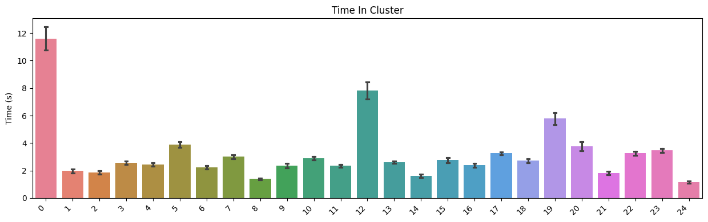

</div>

<div class="nb-cell-output nb-output-figure" markdown>

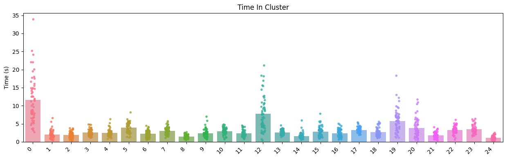

</div>

### Single Summary delegation

Individual `Summary` objects can call the same `sns*` methods.
They delegate to a 1-item `SummaryCollection` internally.
The auto filename is prefixed with the recording handle.

<div class="nb-cell-input" markdown>

```python
single = sc[list(sc.keys())[0]]
fig, ax, df_single = single.snsbar(
    single.time_in_state("within_boundary_static_bodycentre_in_centre"),
    show=True,
    savedir=OUT_DIR,
)
```

</div>

<div class="nb-cell-output nb-output-figure" markdown>

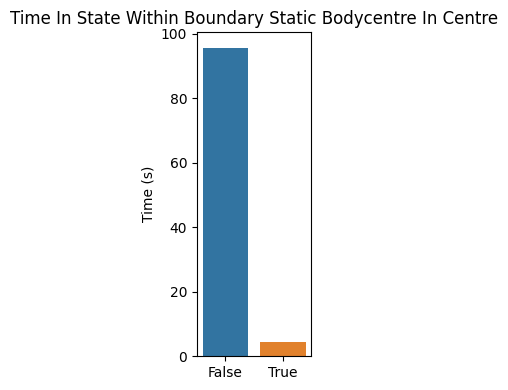

</div>

### Grouped plots

Group by experimental tags with `groupby()` to compare conditions directly.
Use `group_order` to control x-axis arrangement.
`groupby(...)` returns a grouped `SummaryCollection` with the same plotting API.

<div class="nb-cell-input" markdown>

```python
sc_grouped = sc.groupby(tags=["treatment", "timepoint"])

# Keys = tag names (must match groupby tags), values = desired display order
GROUP_ORDER = {"treatment": ["control", "stressor"], "timepoint": ["pre", "post"]}
```

</div>

<div class="nb-cell-input" markdown>

```python
# Scalar metric — grouped superplot
fig, ax, df_gsup = sc_grouped.snssuperplot(
    "total_distance_bodycentre",
    group_order=GROUP_ORDER,
    random_state=42,  # optional, for point jitter
    show=True,
    savedir=str(OUT_DIR),
)
```

</div>

<div class="nb-cell-output nb-output-figure" markdown>

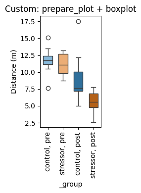

</div>

<div class="nb-cell-input" markdown>

```python
# Multi-component metric — 25 clusters × 4 groups
fig, ax, df_gbar = sc_grouped.snsbar(
    sc_grouped.each.time_in_state("kmeans_25"),
    group_order=GROUP_ORDER,
    show=True,
    savedir=str(OUT_DIR),
)
```

</div>

<div class="nb-cell-output nb-output-figure" markdown>

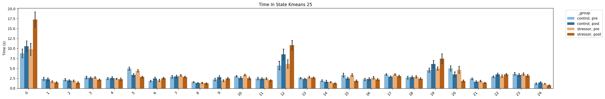

</div>

Even though the summary metric 'time_in_cluster' was created before grouping, the grouped plots
work as expected with this summary metric (but the auto-generated title is different, because we
stored it with a manual name).

<div class="nb-cell-input" markdown>

```python
# Multi-component metric — 25 clusters × 4 groups
fig, ax, df_gbar = sc_grouped.snsbar(
    "time_in_cluster",
    group_order=GROUP_ORDER,
    show=True,
    savedir=str(OUT_DIR),
)
```

</div>

<div class="nb-cell-output nb-output-figure" markdown>


</div>

### sort_by — independent spatial ordering

`sort_by` overrides the spatial arrangement on the x-axis without changing
colour assignment. Here `groupby(tags=["treatment", "timepoint"])` means
treatment drives the base colour (control=blue, stressor=orange). Adding
`sort_by="timepoint"` interleaves control/stressor within each timepoint.

<div class="nb-cell-input" markdown>

```python
# Interleaved superplot — timepoint as primary spatial axis, colours by treatment
fig, ax, df_interleaved = sc_grouped.snssuperplot(
    "total_distance_bodycentre",
    group_order=GROUP_ORDER,
    sort_by="timepoint",
    random_state=42,  # optional, for point jitter
    show=True,
    savedir=str(OUT_DIR),
    filename="total_distance_interleaved_superplot.png",
)
```

</div>

<div class="nb-cell-output nb-output-figure" markdown>

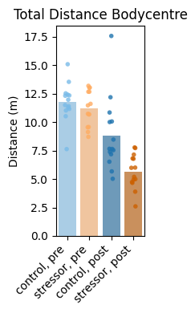

</div>

<div class="nb-cell-input" markdown>

```python
# Power-user workflow with prepare_plot — full seaborn control
import seaborn as sns

spec = sc_grouped.prepare_plot(
    "total_distance_bodycentre",
    group_order=GROUP_ORDER,
    sort_by=["timepoint", "treatment"],
)
sns.boxplot(**spec.sns_kwargs, width=0.6)
spec.ax.set_ylabel(spec.ylabel)
spec.ax.set_title("Custom: prepare_plot + boxplot")
import matplotlib.pyplot as plt

plt.xticks(rotation=90)
plt.tight_layout()
plt.show()
```

</div>

<div class="nb-cell-output nb-output-figure" markdown>


</div>

### Statistical annotations

Use `annotate="help"` to discover available tests, corrections, and the
group labels in your data. Then pass `annotate={...}` with actual pairs.

<div class="nb-cell-input" markdown>

```python
# Discover labels and options (no annotation applied, just prints a guide)
fig_ann, ax_ann, df_ann = sc_grouped.snssuperplot(
    "total_distance_bodycentre",
    group_order=GROUP_ORDER,
    annotate="help",
    random_state=42,  # optional, for point jitter
    show=False,
)
```

</div>

<div class="nb-cell-output">
<pre><code>=== Statistical Annotation Guide ===

annotate={
    &quot;pairs&quot;: [(&quot;groupA&quot;, &quot;groupB&quot;), ...],  # REQUIRED
    &quot;test&quot;: &quot;Mann-Whitney&quot;,                # see below
    &quot;correction&quot;: None,                    # see below
    &quot;text_format&quot;: &quot;star&quot;,                 # &quot;star&quot;, &quot;simple&quot;, &quot;full&quot;
    &quot;headroom&quot;: None,                      # float multiplier, see below
}

Available tests:
  Parametric:     t-test_ind, t-test_welch, t-test_paired
  Non-parametric: Mann-Whitney, Wilcoxon, Kruskal, Brunner-Munzel
  Other:          Levene (variance equality)

  Tip: Mann-Whitney is a safe default for most behavioural data.
  Use paired tests (t-test_paired, Wilcoxon) for repeated measures.
  Use parametric tests only if data is normally distributed.

Multiple comparisons correction (recommended for &gt;3 pairs):
  FWER (conservative): bonferroni, holm
  FDR  (less conservative): fdr_bh (Benjamini-Hochberg), fdr_by

Headroom:
  Extra vertical space for brackets, as a fraction of the y range.
  E.g. headroom=0.3 adds 30%% extra room above the data.

Your labels: [&#x27;control, post&#x27;, &#x27;control, pre&#x27;, &#x27;stressor, post&#x27;, &#x27;stressor, pre&#x27;]</code></pre>
</div>

<div class="nb-cell-input" markdown>

```python
# Apply annotations
fig_ann, ax_ann, df_ann = sc_grouped.snsbox(
    "total_distance_bodycentre",
    group_order=GROUP_ORDER,
    annotate={
        "pairs": [("control, pre", "stressor, pre"), ("control, post", "stressor, post")],
        "test": "Mann-Whitney",
        "correction": None,
        "text_format": "star",
        "headroom": 0.0,  # add extra space for annotations if needed
    },
    savedir=str(OUT_DIR),
    filename="total_distance_annotated_superplot.png",
    show=True,
)
```

</div>

<div class="nb-cell-output">
<pre><code>p-value annotation legend:
      ns: 5.00e-02 &lt; p &lt;= 1.00e+00
       *: 1.00e-02 &lt; p &lt;= 5.00e-02
      **: 1.00e-03 &lt; p &lt;= 1.00e-02
     ***: 1.00e-04 &lt; p &lt;= 1.00e-03
    ****: p &lt;= 1.00e-04

control, pre vs. stressor, pre: Mann-Whitney-Wilcoxon test two-sided, P_val:5.053e-01 U_stat=1.130e+02
control, post vs. stressor, post: Mann-Whitney-Wilcoxon test two-sided, P_val:1.926e-03 U_stat=1.660e+02</code></pre>
</div>

<div class="nb-cell-output nb-output-figure" markdown>


</div>

### Metric input options

Two ways to pass a metric to any `sns*` method:

1. **String key** — a previously stored metric name
2. **SummaryResult** object — inline computation (not stored)
Both options can represent single- or multi-component metrics.

<div class="nb-cell-input" markdown>

```python
# 1. String key
fig, ax, _ = sc.snsstrip(
    "total_distance_bodycentre",
    random_state=42,  # optional, for point jitter
    show=False,
)

# 2. SummaryResult object (inline)
fig, ax, df_mc = sc.snsbar(
    sc.each.time_in_state("within_boundary_static_bodycentre_in_centre"),
    show=False,
)
```

</div>

### Multi-metric plotting

`sns*` methods can accept multiple metrics via list input, or alias maps via dict input.
`merge_by` controls how metrics are combined (default: `"metric"`).
When plotting multiple metrics together, they must share a common y-axis label.

<div class="nb-cell-input" markdown>

```python
# Ungrouped multi-metric demo combining two by_state metrics with the same y-axis
# (mean speed of bodycentre):
# - corners
# - kmeans clusters with explicit all_states=[0..9]
fig, ax, df_multi_flat = sc.snsbar(
    {
        "corners": "mean_speed_corners",
        "kmeans_0_to_9": "mean_speed_bodycentre_by_kmeans_25",
    },
    show=True,
    savedir=OUT_DIR,
    filename="demo_multi_metric_by_state_speed_barplot.png",
)
```

</div>

<div class="nb-cell-output nb-output-figure" markdown>


</div>

<div class="nb-cell-input" markdown>

```python
# Grouped multi-metric demo
fig, ax, df_multi_grouped = sc_grouped.snsbar(
    ["time_in_centre", "time_in_cluster"],
    merge_by=None,
    group_order=GROUP_ORDER,
    show=True,
    savedir=OUT_DIR,
    filename="demo_multi_metric_grouped_barplot.png",
)
```

</div>

<div class="nb-cell-output nb-output-figure" markdown>

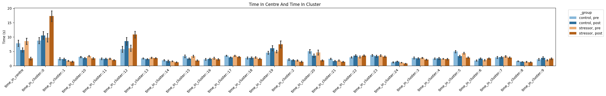

</div>

## Behaviour Flow Analysis (BFA)

### Compute BFA results and statistics

`bfa()` returns a nested dict of observed/shuffled transition statistics,
and `bfa_stats()` derives effect-size-style summaries for reporting.
`all_states=np.arange(0, N_CLUSTERS)` makes the state space explicit.

<div class="nb-cell-input" markdown>

```python
bfa_results = sc_grouped.bfa(
    column="kmeans_25",
    all_states=np.arange(0, N_CLUSTERS),
    random_state=42,
)
bfa_stats = p3b.SummaryCollection.bfa_stats(bfa_results)

with open(f"{OUT_DIR}/bfa_results.json", "w") as f:
    json.dump(bfa_results, f, indent=4)
with open(f"{OUT_DIR}/bfa_stats.json", "w") as f:
    json.dump(bfa_stats, f, indent=4)
```

</div>

### BFA histograms

Distribution of shuffled transition values vs observed, per group comparison.
Useful as a quick sanity check before interpreting chord/UMAP views.

<div class="nb-cell-input" markdown>

```python
p3b.SummaryCollection.plot_bfa_results(
    bfa_results,
    add_stats=True,
    stats=bfa_stats,
    bins=20,
    figsize=(4, 3),
    save_dir=OUT_DIR,
    show=True,
)
```

</div>

<div class="nb-cell-output nb-output-figure" markdown>

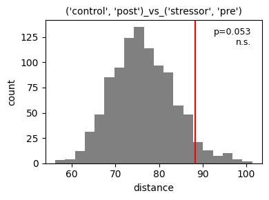

</div>

<div class="nb-cell-output nb-output-figure" markdown>

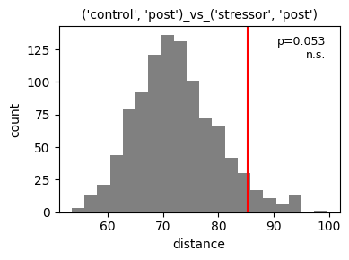

</div>

<div class="nb-cell-output nb-output-figure" markdown>

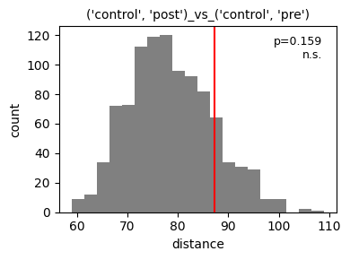

</div>

<div class="nb-cell-output nb-output-figure" markdown>

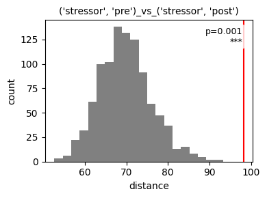

</div>

<div class="nb-cell-output nb-output-figure" markdown>

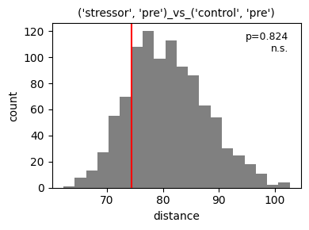

</div>

<div class="nb-cell-output nb-output-figure" markdown>

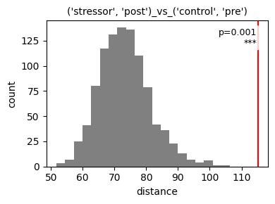

</div>

<div class="nb-cell-output">
<pre><code>{&quot;(&#x27;control&#x27;, &#x27;post&#x27;)_vs_(&#x27;stressor&#x27;, &#x27;pre&#x27;)&quot;: (&lt;Figure size 400x300 with 1 Axes&gt;,
  &lt;Axes: title={&#x27;center&#x27;: &quot;(&#x27;control&#x27;, &#x27;post&#x27;)_vs_(&#x27;stressor&#x27;, &#x27;pre&#x27;)&quot;}, xlabel=&#x27;distance&#x27;, ylabel=&#x27;count&#x27;&gt;),
 &quot;(&#x27;control&#x27;, &#x27;post&#x27;)_vs_(&#x27;stressor&#x27;, &#x27;post&#x27;)&quot;: (&lt;Figure size 400x300 with 1 Axes&gt;,
  &lt;Axes: title={&#x27;center&#x27;: &quot;(&#x27;control&#x27;, &#x27;post&#x27;)_vs_(&#x27;stressor&#x27;, &#x27;post&#x27;)&quot;}, xlabel=&#x27;distance&#x27;, ylabel=&#x27;count&#x27;&gt;),
 &quot;(&#x27;control&#x27;, &#x27;post&#x27;)_vs_(&#x27;control&#x27;, &#x27;pre&#x27;)&quot;: (&lt;Figure size 400x300 with 1 Axes&gt;,
  &lt;Axes: title={&#x27;center&#x27;: &quot;(&#x27;control&#x27;, &#x27;post&#x27;)_vs_(&#x27;control&#x27;, &#x27;pre&#x27;)&quot;}, xlabel=&#x27;distance&#x27;, ylabel=&#x27;count&#x27;&gt;),
 &quot;(&#x27;stressor&#x27;, &#x27;pre&#x27;)_vs_(&#x27;stressor&#x27;, &#x27;post&#x27;)&quot;: (&lt;Figure size 400x300 with 1 Axes&gt;,
  &lt;Axes: title={&#x27;center&#x27;: &quot;(&#x27;stressor&#x27;, &#x27;pre&#x27;)_vs_(&#x27;stressor&#x27;, &#x27;post&#x27;)&quot;}, xlabel=&#x27;distance&#x27;, ylabel=&#x27;count&#x27;&gt;),
 &quot;(&#x27;stressor&#x27;, &#x27;pre&#x27;)_vs_(&#x27;control&#x27;, &#x27;pre&#x27;)&quot;: (&lt;Figure size 400x300 with 1 Axes&gt;,
  &lt;Axes: title={&#x27;center&#x27;: &quot;(&#x27;stressor&#x27;, &#x27;pre&#x27;)_vs_(&#x27;control&#x27;, &#x27;pre&#x27;)&quot;}, xlabel=&#x27;distance&#x27;, ylabel=&#x27;count&#x27;&gt;),
 &quot;(&#x27;stressor&#x27;, &#x27;post&#x27;)_vs_(&#x27;control&#x27;, &#x27;pre&#x27;)&quot;: (&lt;Figure size 400x300 with 1 Axes&gt;,
  &lt;Axes: title={&#x27;center&#x27;: &quot;(&#x27;stressor&#x27;, &#x27;post&#x27;)_vs_(&#x27;control&#x27;, &#x27;pre&#x27;)&quot;}, xlabel=&#x27;distance&#x27;, ylabel=&#x27;count&#x27;&gt;)}</code></pre>
</div>

### GPD-augmented tail p-value

`right_tail_p` (in `bfa_stats`) assumes a Gaussian surrogate distribution,
which is not a valid assumption in general, and the empirical p-value
(`1 - percentile`) is floored at `1 / (numshuffles + 1)` — it cannot resolve
anything more extreme than that no matter how extreme the observation
actually is. `gpd_augmented_p()` reports the same empirical p-value when it
is *not* at that floor, and only when it saturates does it attempt a
Peaks-Over-Threshold GPD tail fit (with automated threshold selection and a
goodness-of-fit gate) to resolve below the floor; if no fit passes its
checks it falls back to the empirical floor rather than guessing. The table
below reports all three side by side, per comparison.

<div class="nb-cell-input" markdown>

```python
gpd_stats = p3b.SummaryCollection.gpd_augmented_p(bfa_results)

bfa_report = pd.DataFrame(
    {
        pair: {
            "p_empirical": 1 - bfa_stats[pair]["percentile"],
            "right_tail_p": bfa_stats[pair]["right_tail_p"],
            "gpd_augmented_p": gpd_stats[pair]["p"],
            "method": gpd_stats[pair]["method"],
            "gpd_fallback": gpd_stats[pair].get("fallback"),
        }
        for pair in bfa_results
    }
).T
bfa_report.index.name = "comparison"

with pd.option_context("display.width", 120, "display.float_format", "{:.3e}".format):
    print(bfa_report)

bfa_report.to_csv(f"{OUT_DIR}/bfa_gpd_report.csv")
with open(f"{OUT_DIR}/bfa_gpd_stats.json", "w") as f:
    json.dump(gpd_stats, f, indent=4)
```

</div>

<div class="nb-cell-output">
<pre><code>                                            p_empirical right_tail_p gpd_augmented_p     method gpd_fallback
comparison                                                                                                  
(&#x27;control&#x27;, &#x27;post&#x27;)_vs_(&#x27;stressor&#x27;, &#x27;pre&#x27;)    6.793e-02    5.915e-02       6.793e-02  empirical        False
(&#x27;control&#x27;, &#x27;post&#x27;)_vs_(&#x27;stressor&#x27;, &#x27;post&#x27;)   8.192e-02    7.269e-02       8.192e-02  empirical        False
(&#x27;control&#x27;, &#x27;post&#x27;)_vs_(&#x27;control&#x27;, &#x27;pre&#x27;)     5.694e-02    4.127e-02       5.694e-02  empirical        False
(&#x27;stressor&#x27;, &#x27;pre&#x27;)_vs_(&#x27;stressor&#x27;, &#x27;post&#x27;)   9.990e-04    3.355e-07       7.299e-05        gpd        False
(&#x27;stressor&#x27;, &#x27;pre&#x27;)_vs_(&#x27;control&#x27;, &#x27;pre&#x27;)     8.242e-01    8.241e-01       8.242e-01  empirical        False
(&#x27;stressor&#x27;, &#x27;post&#x27;)_vs_(&#x27;control&#x27;, &#x27;pre&#x27;)    9.990e-04    1.081e-10       1.935e-10        gpd        False</code></pre>
</div>

### Tail-fit diagnostics

`plot_bfa_tail_diagnostics` draws the same surrogate histograms as above,
overlaid with the Normal curve `right_tail_p` implicitly assumes and — for
any comparison where the empirical p-value saturated and a GPD fit was
accepted — the fitted GPD tail curve, so a saturated or mis-fit tail is
visible rather than only reported as a number.

<div class="nb-cell-input" markdown>

```python
p3b.SummaryCollection.plot_bfa_tail_diagnostics(
    bfa_results,
    gpd_stats=gpd_stats,
    bfa_stats=bfa_stats,
    bins=30,
    figsize=(5, 3.5),
    save_dir=OUT_DIR,
    show=True,
)
```

</div>

<div class="nb-cell-output nb-output-figure" markdown>

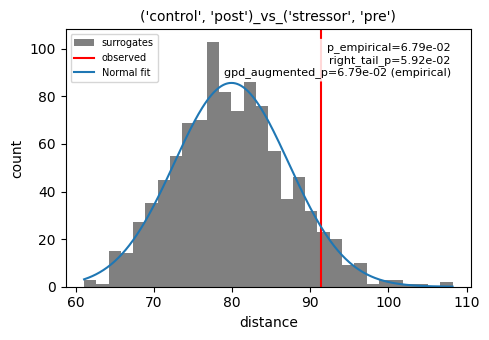

</div>

<div class="nb-cell-output nb-output-figure" markdown>

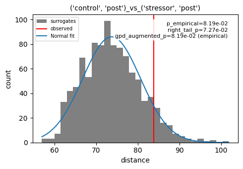

</div>

<div class="nb-cell-output nb-output-figure" markdown>


</div>

<div class="nb-cell-output nb-output-figure" markdown>

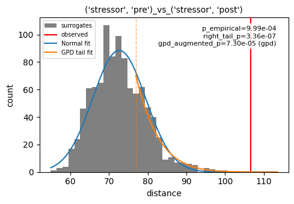

</div>

<div class="nb-cell-output nb-output-figure" markdown>

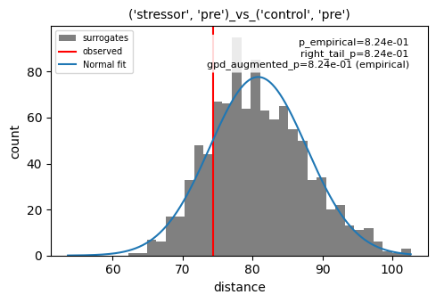

</div>

<div class="nb-cell-output nb-output-figure" markdown>

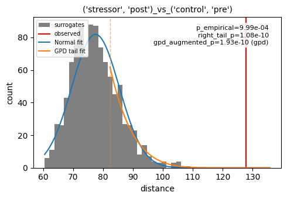

</div>

<div class="nb-cell-output">
<pre><code>{&quot;(&#x27;control&#x27;, &#x27;post&#x27;)_vs_(&#x27;stressor&#x27;, &#x27;pre&#x27;)&quot;: (&lt;Figure size 500x350 with 1 Axes&gt;,
  &lt;Axes: title={&#x27;center&#x27;: &quot;(&#x27;control&#x27;, &#x27;post&#x27;)_vs_(&#x27;stressor&#x27;, &#x27;pre&#x27;)&quot;}, xlabel=&#x27;distance&#x27;, ylabel=&#x27;count&#x27;&gt;),
 &quot;(&#x27;control&#x27;, &#x27;post&#x27;)_vs_(&#x27;stressor&#x27;, &#x27;post&#x27;)&quot;: (&lt;Figure size 500x350 with 1 Axes&gt;,
  &lt;Axes: title={&#x27;center&#x27;: &quot;(&#x27;control&#x27;, &#x27;post&#x27;)_vs_(&#x27;stressor&#x27;, &#x27;post&#x27;)&quot;}, xlabel=&#x27;distance&#x27;, ylabel=&#x27;count&#x27;&gt;),
 &quot;(&#x27;control&#x27;, &#x27;post&#x27;)_vs_(&#x27;control&#x27;, &#x27;pre&#x27;)&quot;: (&lt;Figure size 500x350 with 1 Axes&gt;,
  &lt;Axes: title={&#x27;center&#x27;: &quot;(&#x27;control&#x27;, &#x27;post&#x27;)_vs_(&#x27;control&#x27;, &#x27;pre&#x27;)&quot;}, xlabel=&#x27;distance&#x27;, ylabel=&#x27;count&#x27;&gt;),
 &quot;(&#x27;stressor&#x27;, &#x27;pre&#x27;)_vs_(&#x27;stressor&#x27;, &#x27;post&#x27;)&quot;: (&lt;Figure size 500x350 with 1 Axes&gt;,
  &lt;Axes: title={&#x27;center&#x27;: &quot;(&#x27;stressor&#x27;, &#x27;pre&#x27;)_vs_(&#x27;stressor&#x27;, &#x27;post&#x27;)&quot;}, xlabel=&#x27;distance&#x27;, ylabel=&#x27;count&#x27;&gt;),
 &quot;(&#x27;stressor&#x27;, &#x27;pre&#x27;)_vs_(&#x27;control&#x27;, &#x27;pre&#x27;)&quot;: (&lt;Figure size 500x350 with 1 Axes&gt;,
  &lt;Axes: title={&#x27;center&#x27;: &quot;(&#x27;stressor&#x27;, &#x27;pre&#x27;)_vs_(&#x27;control&#x27;, &#x27;pre&#x27;)&quot;}, xlabel=&#x27;distance&#x27;, ylabel=&#x27;count&#x27;&gt;),
 &quot;(&#x27;stressor&#x27;, &#x27;post&#x27;)_vs_(&#x27;control&#x27;, &#x27;pre&#x27;)&quot;: (&lt;Figure size 500x350 with 1 Axes&gt;,
  &lt;Axes: title={&#x27;center&#x27;: &quot;(&#x27;stressor&#x27;, &#x27;post&#x27;)_vs_(&#x27;control&#x27;, &#x27;pre&#x27;)&quot;}, xlabel=&#x27;distance&#x27;, ylabel=&#x27;count&#x27;&gt;)}</code></pre>
</div>

### Chord diagrams

Requires `pycirclize` — install with `pip install py3r-behaviour[viz]`.

<div class="nb-cell-input" markdown>

```python
if not SKIP_HEAVY_VIZ:
    sc_grouped.plot_chord(
        column="kmeans_25",
        all_states=np.arange(0, N_CLUSTERS),
        save_dir=OUT_DIR,
        show=True,
        start=-265,
        end=95,
        space=5,
        r_lim=(93, 100),
        label_kws=dict(r=94, size=12, color="white"),
        link_kws=dict(ec="black", lw=0.5),
    )
```

</div>

<div class="nb-cell-output nb-output-figure" markdown>

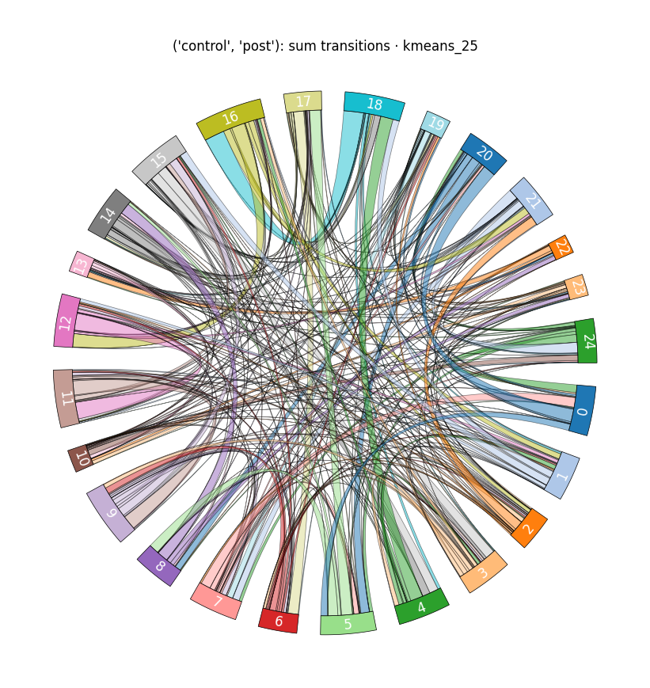

</div>

<div class="nb-cell-output nb-output-figure" markdown>

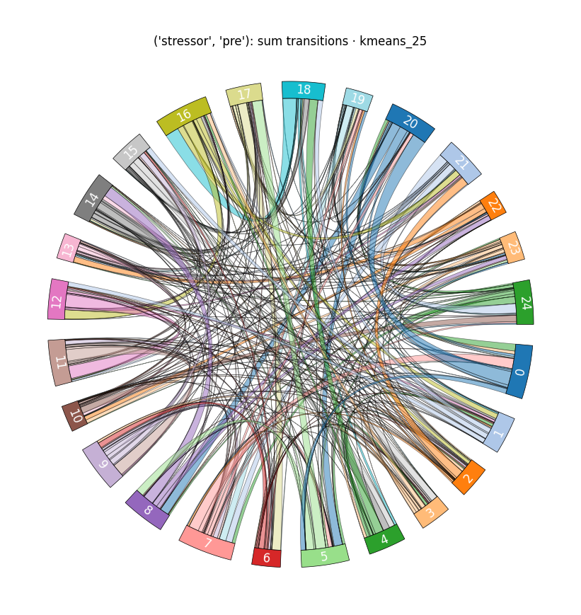

</div>

<div class="nb-cell-output nb-output-figure" markdown>

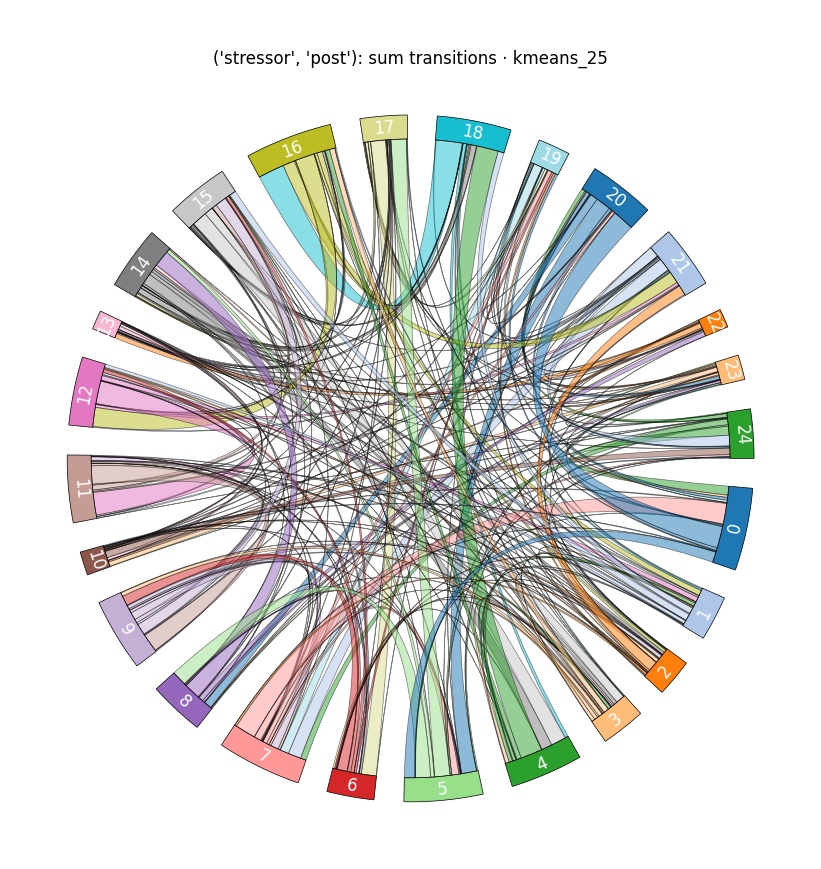

</div>

<div class="nb-cell-output nb-output-figure" markdown>

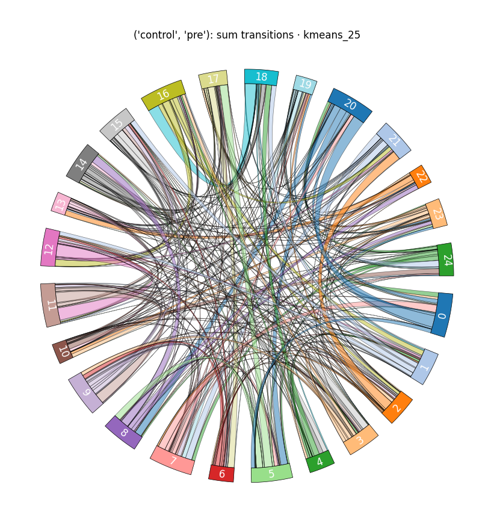

</div>

### UMAP embedding of transition matrices

Requires `umap-learn` — install with `pip install py3r-behaviour[viz]`.

<div class="nb-cell-input" markdown>

```python
if not SKIP_HEAVY_VIZ:
    fig, ax = sc_grouped.plot_transition_umap(
        column="kmeans_25",
        all_states=np.arange(0, N_CLUSTERS),
        n_neighbors=15,
        min_dist=0.1,
        random_state=42,
        figsize=(6, 5),
        show=True,
        save_dir=str(OUT_DIR),
    )
```

</div>

<div class="nb-cell-output nb-output-figure" markdown>

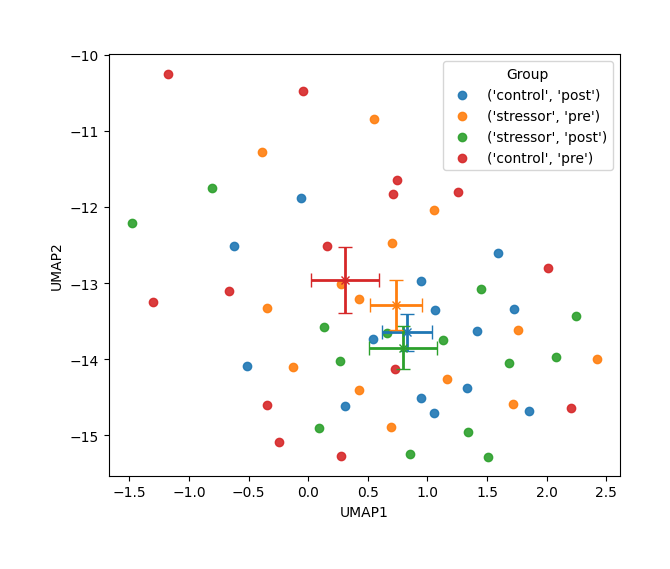

</div>

## Done
