<!-- AUTO-GENERATED by tools/render_notebooks.py — do not edit manually -->

<div class="nb-cell-input" markdown>

```python
import os  # noqa: E402

TEST_MODE = True
# Skip heavy visualization dependencies (pycirclize, umap) in CI environments
SKIP_HEAVY_VIZ = os.environ.get("CI") == "true"
```

</div>

set (local) paths

<div class="nb-cell-input" markdown>

```python
import json  # noqa: E402
from pathlib import Path  # noqa: E402

import numpy as np  # noqa: E402
import pandas as pd  # noqa: E402

# Inputs (bundled with the notebook)
if TEST_MODE:
    DATA_DIR = Path("data/tracking")
    TAGS_CSV = Path("data/tags.csv")
else:
    raise NotImplementedError("Example dataset artifact not yet bundled with package")

# Outputs (isolated, overridable)
OUT_DIR = Path(os.environ.get("NB_OUT_DIR", Path.cwd() / "_artifacts"))
OUT_DIR.mkdir(parents=True, exist_ok=True)

# Recording parameters
FPS = 25
```

</div>

load a tracking collection from a folder (dlc format)

<div class="nb-cell-input" markdown>

```python
import py3r.behaviour as p3b  # noqa: E402

tc = p3b.TrackingCollection.from_dlc_folder(
    folder_path=DATA_DIR,
    fps=FPS,
    aspectratio_correction=0.75,
)
print(tc)
```

</div>

<div class="nb-cell-output">
<pre><code>&lt;TrackingCollection with 24 Tracking objects&gt;</code></pre>
</div>

Add tags from a CSV for grouping/analysis.

CSV must contain a 'handle' column matching filenames (without extension)
other column names are the tag names, and those column values are the tag values.
See example file `tags.csv`

<div class="nb-cell-input" markdown>

```python
tc.add_tags_from_csv(csv_path=TAGS_CSV)
tc.tags_info()
```

</div>

<div class="nb-cell-output">
<pre><code>added 48 tags to 24 elements in collection.</code></pre>
</div>

<div class="nb-cell-output nb-output-table">
<div>
<style scoped>
    .dataframe tbody tr th:only-of-type {
        vertical-align: middle;
    }

    .dataframe tbody tr th {
        vertical-align: top;
    }

    .dataframe thead th {
        text-align: right;
    }
</style>
<table border="1" class="dataframe">
  <thead>
    <tr style="text-align: right;">
      <th></th>
      <th>attached_to</th>
      <th>missing_from</th>
      <th>unique_values</th>
    </tr>
    <tr>
      <th>tag</th>
      <th></th>
      <th></th>
      <th></th>
    </tr>
  </thead>
  <tbody>
    <tr>
      <th>timepoint</th>
      <td>24</td>
      <td>0</td>
      <td>2</td>
    </tr>
    <tr>
      <th>treatment</th>
      <td>24</td>
      <td>0</td>
      <td>2</td>
    </tr>
  </tbody>
</table>
</div>
</div>

basic preprocessing

<div class="nb-cell-input" markdown>

```python
# Remove low-confidence detections (thresholds depend on your tracking software/data)
tc.filter_likelihood(threshold=0.5)

# Interpolate missing points before smoothing
tc.interpolate(limit=5)

# Smooth all points with mean centre window 3
tc.smooth_all(window=3, method="mean")

# Rescale distance to metres according to two corners of the OFT, here named 'tl' and 'br'
tc.rescale_by_known_distance(point1="tl", point2="br", distance_in_metres=0.64)
```

</div>

<div class="nb-cell-output">
<pre><code>{&#x27;USSOFT2_5DeepCut_resnet50_Blockcourse1May9shuffle1_1030000&#x27;: None,
 &#x27;USSOFT2_11DeepCut_resnet50_Blockcourse1May9shuffle1_1030000&#x27;: None,
 &#x27;USSOFT1_6DeepCut_resnet50_Blockcourse1May9shuffle1_1030000&#x27;: None,
 &#x27;USSOFT2_7DeepCut_resnet50_Blockcourse1May9shuffle1_1030000&#x27;: None,
 &#x27;USSOFT2_13DeepCut_resnet50_Blockcourse1May9shuffle1_1030000&#x27;: None,
 &#x27;USSOFT1_4DeepCut_resnet50_Blockcourse1May9shuffle1_1030000&#x27;: None,
 &#x27;USSOFT1_2DeepCut_resnet50_Blockcourse1May9shuffle1_1030000&#x27;: None,
 &#x27;USSOFT2_1DeepCut_resnet50_Blockcourse1May9shuffle1_1030000&#x27;: None,
 &#x27;USSOFT2_3DeepCut_resnet50_Blockcourse1May9shuffle1_1030000&#x27;: None,
 &#x27;USSOFT1_10DeepCut_resnet50_Blockcourse1May9shuffle1_1030000&#x27;: None,
 &#x27;USSOFT1_8DeepCut_resnet50_Blockcourse1May9shuffle1_1030000&#x27;: None,
 &#x27;USSOFT2_9DeepCut_resnet50_Blockcourse1May9shuffle1_1030000&#x27;: None,
 &#x27;USSOFT1_13DeepCut_resnet50_Blockcourse1May9shuffle1_1030000&#x27;: None,
 &#x27;USSOFT1_11DeepCut_resnet50_Blockcourse1May9shuffle1_1030000&#x27;: None,
 &#x27;USSOFT2_8DeepCut_resnet50_Blockcourse1May9shuffle1_1030000&#x27;: None,
 &#x27;USSOFT1_9DeepCut_resnet50_Blockcourse1May9shuffle1_1030000&#x27;: None,
 &#x27;USSOFT2_6DeepCut_resnet50_Blockcourse1May9shuffle1_1030000&#x27;: None,
 &#x27;USSOFT1_5DeepCut_resnet50_Blockcourse1May9shuffle1_1030000&#x27;: None,
 &#x27;USSOFT2_4DeepCut_resnet50_Blockcourse1May9shuffle1_1030000&#x27;: None,
 &#x27;USSOFT1_7DeepCut_resnet50_Blockcourse1May9shuffle1_1030000&#x27;: None,
 &#x27;USSOFT2_10DeepCut_resnet50_Blockcourse1May9shuffle1_1030000&#x27;: None,
 &#x27;USSOFT1_1DeepCut_resnet50_Blockcourse1May9shuffle1_1030000&#x27;: None,
 &#x27;USSOFT2_2DeepCut_resnet50_Blockcourse1May9shuffle1_1030000&#x27;: None,
 &#x27;USSOFT1_3DeepCut_resnet50_Blockcourse1May9shuffle1_1030000&#x27;: None}</code></pre>
</div>

basic plots

<div class="nb-cell-input" markdown>

```python
# Plot trajectories (per recording, using 'bodycentre'
# for trajectory of mouse and corners of OFT as static frame)
trajectories = ["bodycentre"]
static = ["tl", "tr", "bl", "br"]
lines = [("tr", "tl"), ("tl", "bl"), ("bl", "br"), ("br", "tr")]

# save plots for all recordings to OUT_DIR
tc.plot(
    trajectories=trajectories,
    static=static,
    lines=lines,
    show=False,
    savedir=OUT_DIR,
)

# single inline display plot for QC
tc[0].plot(trajectories=trajectories, static=static, lines=lines, show=True)
```

</div>

<div class="nb-cell-output">
<pre><code>
Collection: unnamed</code></pre>
</div>

<div class="nb-cell-output nb-output-figure" markdown>

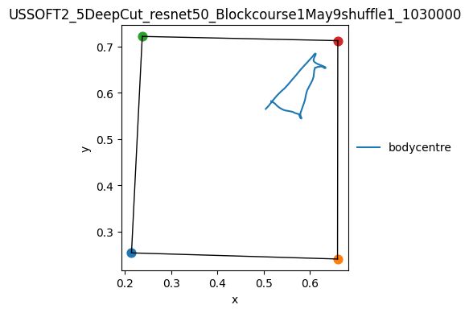

</div>

<div class="nb-cell-output">
<pre><code>(&lt;Figure size 500x500 with 1 Axes&gt;,
 &lt;Axes: title={&#x27;center&#x27;: &#x27;USSOFT2_5DeepCut_resnet50_Blockcourse1May9shuffle1_1030000&#x27;}, xlabel=&#x27;x&#x27;, ylabel=&#x27;y&#x27;&gt;)</code></pre>
</div>

create a `FeaturesCollection` object from the `TrackingCollection`

<div class="nb-cell-input" markdown>

```python
fc = p3b.FeaturesCollection.from_tracking_collection(tc)
```

</div>

compute basic OFT features (time in center)

<div class="nb-cell-input" markdown>

```python
# Define boundary of center area and check if mouse
# (defined by 'bodycentre') is inside defined boundary
center_boundary = fc.define_boundary(["tl", "tr", "bl", "br"], scaling=0.5)
in_center = fc.within_boundary_static(
    point="bodycentre", boundary=center_boundary, boundary_name="center"
)
in_center.store()

# Distance change for center calculations
dist_change = fc.distance_change("bodycentre")
dist_change_in_center = in_center.astype("Int64") * dist_change
dist_change_in_center.store(name="dist_change_bodycentre_in_center")
```

</div>

compute features for BFA clustering

<div class="nb-cell-input" markdown>

```python
# Speed of different keypoints
fc.speed("nose").store()
fc.speed("neck").store()
fc.speed("earr").store()
fc.speed("earl").store()
fc.speed("bodycentre").store()
fc.speed("hipl").store()
fc.speed("hipr").store()
fc.speed("tailbase").store()

# Angle deviations
fc.azimuth_deviation("tailbase", "hipr", "hipl").store()
fc.azimuth_deviation("bodycentre", "tailbase", "neck").store()
fc.azimuth_deviation("neck", "bodycentre", "headcentre").store()
fc.azimuth_deviation("headcentre", "earr", "earl").store()

# Distance between two keypoints
fc.distance_between("nose", "headcentre").store()
fc.distance_between("neck", "headcentre").store()
fc.distance_between("neck", "bodycentre").store()
fc.distance_between("bcr", "bodycentre").store()
fc.distance_between("bcl", "bodycentre").store()
fc.distance_between("tailbase", "bodycentre").store()
fc.distance_between("tailbase", "hipr").store()
fc.distance_between("tailbase", "hipl").store()
fc.distance_between("bcr", "hipr").store()
fc.distance_between("bcl", "hipl").store()
fc.distance_between("bcl", "earl").store()
fc.distance_between("bcr", "earr").store()
fc.distance_between("nose", "earr").store()
fc.distance_between("nose", "earl").store()

# Area spanned by three or four keypoints
fc.area_of_boundary(["tailbase", "hipr", "hipl"], median=False).store()
fc.area_of_boundary(["hipr", "hipl", "bcl", "bcr"], median=False).store()
fc.area_of_boundary(["bcr", "earr", "earl", "bcl"], median=False).store()
fc.area_of_boundary(["earr", "nose", "earl"], median=False).store()

# Distance to OFT boundary
bdry = fc.define_boundary(["tl", "tr", "br", "bl"], scaling=1.0)
fc.distance_to_boundary_static("nose", bdry, boundary_name="oft").store()
fc.distance_to_boundary_static("neck", bdry, boundary_name="oft").store()
fc.distance_to_boundary_static("bodycentre", bdry, boundary_name="oft").store()
fc.distance_to_boundary_static("tailbase", bdry, boundary_name="oft").store()
```

</div>

<div class="nb-cell-output">
<pre><code>/Users/work/Documents/GitHub/py3r_behaviour/src/py3r/behaviour/util/base_collection.py:94: UserWarning: using fully dynamic boundary
  results[key] = getattr(obj, _method_name)(*args, **kwargs)
/Users/work/Documents/GitHub/py3r_behaviour/src/py3r/behaviour/util/base_collection.py:94: UserWarning: using fully dynamic boundary
  results[key] = getattr(obj, _method_name)(*args, **kwargs)
/Users/work/Documents/GitHub/py3r_behaviour/src/py3r/behaviour/util/base_collection.py:94: UserWarning: using fully dynamic boundary
  results[key] = getattr(obj, _method_name)(*args, **kwargs)
/Users/work/Documents/GitHub/py3r_behaviour/src/py3r/behaviour/util/base_collection.py:94: UserWarning: using fully dynamic boundary
  results[key] = getattr(obj, _method_name)(*args, **kwargs)</code></pre>
</div>

save features to csv

<div class="nb-cell-input" markdown>

```python
fc.save(f"{OUT_DIR}/features", data_format="csv", overwrite=True)
```

</div>

create dictionary for feature embedding and perform k-means clustering

<div class="nb-cell-input" markdown>

```python
# Create dictionary for feature embedding
features = fc[0].data.columns
offset = list(np.arange(-15, 16, 1))
embedding_dict = {f: offset for f in features}

# Cluster the embedded feature space using k-means clustering
# The keyword n_clusters defines the number of clusters used.
N_CLUSTERS = 25
cluster_labels, centroids, _ = fc.cluster_embedding(
    embedding_dict=embedding_dict, n_clusters=N_CLUSTERS
)
cluster_labels.store("kmeans_25", overwrite=True)
```

</div>

create a `SummaryCollection` object from the `FeaturesCollection`

<div class="nb-cell-input" markdown>

```python
sc = p3b.SummaryCollection.from_features_collection(fc)
```

</div>

compute summary measures per recording

<div class="nb-cell-input" markdown>

```python
# Total distance moved
sc.total_distance("bodycentre").store()

# Time in center
sc.time_true("within_boundary_static_bodycentre_in_center").store("time_in_center")

# Distance moved in center
sc.sum_column("dist_change_bodycentre_in_center").store(name="distance_moved_in_center")
```

</div>

collate scalar outputs into DataFrame and save results in CSV

<div class="nb-cell-input" markdown>

```python
summary_df = sc.to_df(include_tags=True)
summary_df.to_csv(f"{OUT_DIR}/OFT_results.csv")
summary_df.head()
```

</div>

<div class="nb-cell-output nb-output-table">
<div>
<style scoped>
    .dataframe tbody tr th:only-of-type {
        vertical-align: middle;
    }

    .dataframe tbody tr th {
        vertical-align: top;
    }

    .dataframe thead th {
        text-align: right;
    }
</style>
<table border="1" class="dataframe">
  <thead>
    <tr style="text-align: right;">
      <th></th>
      <th>total_distance_bodycentre</th>
      <th>time_in_center</th>
      <th>distance_moved_in_center</th>
      <th>tag_timepoint</th>
      <th>tag_treatment</th>
    </tr>
    <tr>
      <th>handle</th>
      <th></th>
      <th></th>
      <th></th>
      <th></th>
      <th></th>
    </tr>
  </thead>
  <tbody>
    <tr>
      <th>USSOFT2_5DeepCut_resnet50_Blockcourse1May9shuffle1_1030000</th>
      <td>0.430189</td>
      <td>0.32</td>
      <td>0.057087</td>
      <td>1d</td>
      <td>FST</td>
    </tr>
    <tr>
      <th>USSOFT2_11DeepCut_resnet50_Blockcourse1May9shuffle1_1030000</th>
      <td>2.154820</td>
      <td>0.20</td>
      <td>0.383825</td>
      <td>1d</td>
      <td>control</td>
    </tr>
    <tr>
      <th>USSOFT1_6DeepCut_resnet50_Blockcourse1May9shuffle1_1030000</th>
      <td>0.503431</td>
      <td>2.08</td>
      <td>0.314483</td>
      <td>45m</td>
      <td>control</td>
    </tr>
    <tr>
      <th>USSOFT2_7DeepCut_resnet50_Blockcourse1May9shuffle1_1030000</th>
      <td>1.817500</td>
      <td>0.04</td>
      <td>0.143321</td>
      <td>1d</td>
      <td>FST</td>
    </tr>
    <tr>
      <th>USSOFT2_13DeepCut_resnet50_Blockcourse1May9shuffle1_1030000</th>
      <td>0.683247</td>
      <td>0.20</td>
      <td>0.162883</td>
      <td>1d</td>
      <td>FST</td>
    </tr>
  </tbody>
</table>
</div>
</div>

seaborn plotting wrappers

Demonstrates the sns* plotting API on flat and grouped SummaryCollections.
All plots use auto-generated titles, ylabels, and filenames.

group by tags for grouped analyses and plotting

<div class="nb-cell-input" markdown>

```python
sc_grouped = sc.groupby(tags=["treatment", "timepoint"])

# group_order controls display ordering on plots:
# keys = tag names (matching groupby tags), values = desired value order
GROUP_ORDER = {"treatment": ["control", "FST"], "timepoint": ["45m", "1d"]}

# --- 4. Grouped SC superplot (scalar stored metric) ---
# Scalar metric with group_order; auto palette, auto ylabel from stored meta.
fig_gsup, ax_gsup, df_gsup = sc_grouped.snssuperplot(
    "total_distance_bodycentre",
    group_order=GROUP_ORDER,
    show=True,
    savedir=str(OUT_DIR),
)
print(f"Grouped superplot: {len(df_gsup)} rows, groups: {list(df_gsup['_group'].unique())}")

# --- 5. Grouped SC bar (multi-component SummaryResult + group_order) ---
# 25 clusters × 4 groups, component-major ordering with groups dodged per cluster.
fig_gbar, ax_gbar, df_gbar = sc_grouped.snsbar(
    sc_grouped.time_in_state("kmeans_25"),
    group_order=GROUP_ORDER,
    show=True,
    savedir=str(OUT_DIR),
)
print(
    f"Grouped bar kmeans: {len(df_gbar)} rows, "
    f"{df_gbar['component'].nunique()} components, "
    f"{df_gbar['_group'].nunique()} groups"
)
```

</div>

<div class="nb-cell-output nb-output-figure" markdown>

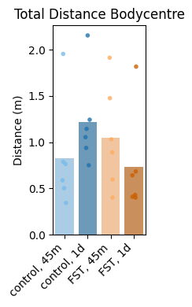

</div>

<div class="nb-cell-output">
<pre><code>Grouped superplot: 24 rows, groups: [&#x27;FST, 1d&#x27;, &#x27;control, 1d&#x27;, &#x27;control, 45m&#x27;, &#x27;FST, 45m&#x27;]</code></pre>
</div>

<div class="nb-cell-output nb-output-figure" markdown>

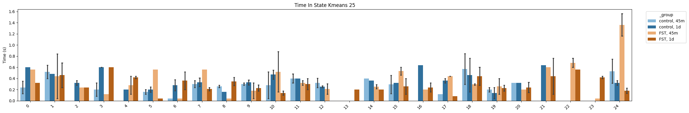

</div>

<div class="nb-cell-output">
<pre><code>Grouped bar kmeans: 174 rows, 25 components, 4 groups</code></pre>
</div>

perform behavior flow analysis (BFA)

<div class="nb-cell-input" markdown>

```python
# Perform behavior flow analysis on clustering results
bfa_results = sc_grouped.bfa(column="kmeans_25", all_states=np.arange(0, N_CLUSTERS))

# Save BFA results
with open(f"{OUT_DIR}/bfa_results.json", "w") as f:
    json.dump(bfa_results, f, indent=4)
```

</div>

compute BFA statistics

<div class="nb-cell-input" markdown>

```python
# Compute the statistics and save the results
bfa_stats = p3b.SummaryCollection.bfa_stats(bfa_results)

with open(f"{OUT_DIR}/bfa_stats.json", "w") as f:
    json.dump(bfa_stats, f, indent=4)
```

</div>

plot BFA chord diagrams (requires pycirclize - skipped in CI)

<div class="nb-cell-input" markdown>

```python
if not SKIP_HEAVY_VIZ:
    sc_grouped.plot_chord(
        column="kmeans_25",
        all_states=np.arange(0, N_CLUSTERS),
        save_dir=OUT_DIR,
        show=True,
        start=-265,
        end=95,
        space=5,
        r_lim=(93, 100),
        label_kws=dict(r=94, size=12, color="white"),
        link_kws=dict(ec="black", lw=0.5),
    )
```

</div>

<div class="nb-cell-output nb-output-figure" markdown>

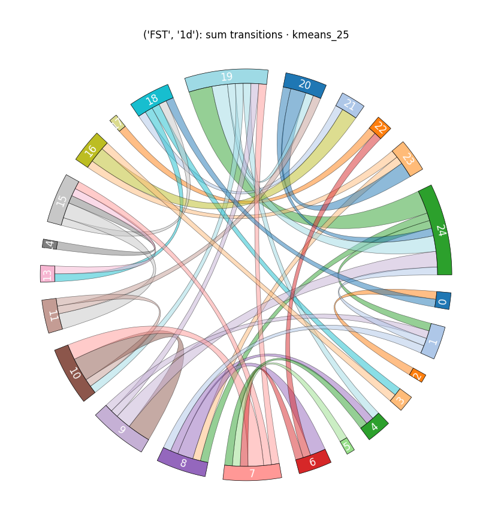

</div>

<div class="nb-cell-output nb-output-figure" markdown>


</div>

<div class="nb-cell-output nb-output-figure" markdown>

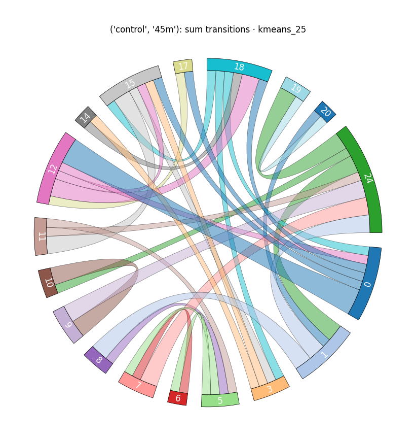

</div>

<div class="nb-cell-output nb-output-figure" markdown>

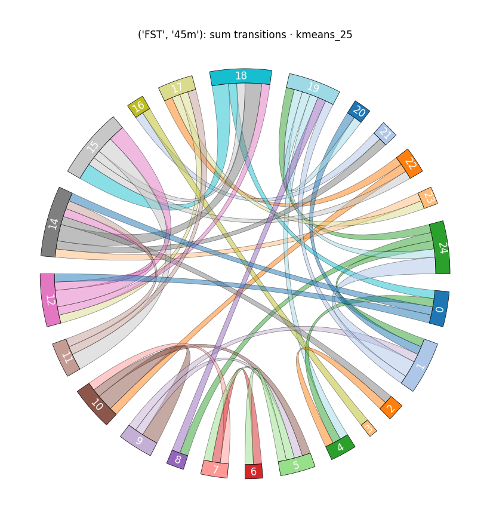

</div>

plot BFA histograms

<div class="nb-cell-input" markdown>

```python
# Plot BFA result histograms showing distribution of shuffled values vs observed
p3b.SummaryCollection.plot_bfa_results(
    bfa_results,
    add_stats=True,
    stats=bfa_stats,
    bins=20,
    figsize=(4, 3),
    save_dir=OUT_DIR,
    show=True,
)
```

</div>

<div class="nb-cell-output nb-output-figure" markdown>


</div>

<div class="nb-cell-output nb-output-figure" markdown>

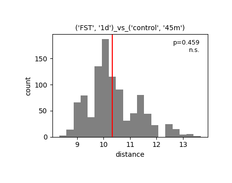

</div>

<div class="nb-cell-output nb-output-figure" markdown>

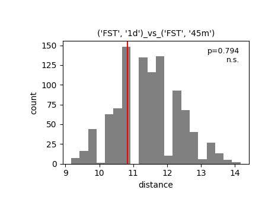

</div>

<div class="nb-cell-output nb-output-figure" markdown>

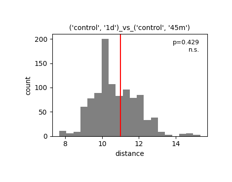

</div>

<div class="nb-cell-output nb-output-figure" markdown>

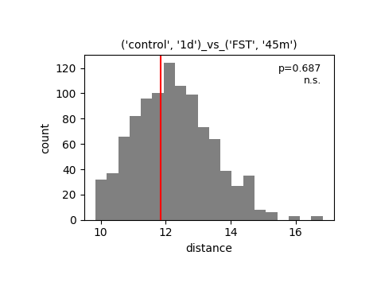

</div>

<div class="nb-cell-output nb-output-figure" markdown>

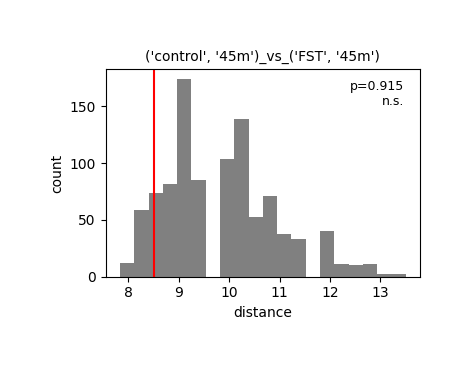

</div>

<div class="nb-cell-output">
<pre><code>{&quot;(&#x27;FST&#x27;, &#x27;1d&#x27;)_vs_(&#x27;control&#x27;, &#x27;1d&#x27;)&quot;: (&lt;Figure size 400x300 with 1 Axes&gt;,
  &lt;Axes: title={&#x27;center&#x27;: &quot;(&#x27;FST&#x27;, &#x27;1d&#x27;)_vs_(&#x27;control&#x27;, &#x27;1d&#x27;)&quot;}, xlabel=&#x27;distance&#x27;, ylabel=&#x27;count&#x27;&gt;),
 &quot;(&#x27;FST&#x27;, &#x27;1d&#x27;)_vs_(&#x27;control&#x27;, &#x27;45m&#x27;)&quot;: (&lt;Figure size 400x300 with 1 Axes&gt;,
  &lt;Axes: title={&#x27;center&#x27;: &quot;(&#x27;FST&#x27;, &#x27;1d&#x27;)_vs_(&#x27;control&#x27;, &#x27;45m&#x27;)&quot;}, xlabel=&#x27;distance&#x27;, ylabel=&#x27;count&#x27;&gt;),
 &quot;(&#x27;FST&#x27;, &#x27;1d&#x27;)_vs_(&#x27;FST&#x27;, &#x27;45m&#x27;)&quot;: (&lt;Figure size 400x300 with 1 Axes&gt;,
  &lt;Axes: title={&#x27;center&#x27;: &quot;(&#x27;FST&#x27;, &#x27;1d&#x27;)_vs_(&#x27;FST&#x27;, &#x27;45m&#x27;)&quot;}, xlabel=&#x27;distance&#x27;, ylabel=&#x27;count&#x27;&gt;),
 &quot;(&#x27;control&#x27;, &#x27;1d&#x27;)_vs_(&#x27;control&#x27;, &#x27;45m&#x27;)&quot;: (&lt;Figure size 400x300 with 1 Axes&gt;,
  &lt;Axes: title={&#x27;center&#x27;: &quot;(&#x27;control&#x27;, &#x27;1d&#x27;)_vs_(&#x27;control&#x27;, &#x27;45m&#x27;)&quot;}, xlabel=&#x27;distance&#x27;, ylabel=&#x27;count&#x27;&gt;),
 &quot;(&#x27;control&#x27;, &#x27;1d&#x27;)_vs_(&#x27;FST&#x27;, &#x27;45m&#x27;)&quot;: (&lt;Figure size 400x300 with 1 Axes&gt;,
  &lt;Axes: title={&#x27;center&#x27;: &quot;(&#x27;control&#x27;, &#x27;1d&#x27;)_vs_(&#x27;FST&#x27;, &#x27;45m&#x27;)&quot;}, xlabel=&#x27;distance&#x27;, ylabel=&#x27;count&#x27;&gt;),
 &quot;(&#x27;control&#x27;, &#x27;45m&#x27;)_vs_(&#x27;FST&#x27;, &#x27;45m&#x27;)&quot;: (&lt;Figure size 400x300 with 1 Axes&gt;,
  &lt;Axes: title={&#x27;center&#x27;: &quot;(&#x27;control&#x27;, &#x27;45m&#x27;)_vs_(&#x27;FST&#x27;, &#x27;45m&#x27;)&quot;}, xlabel=&#x27;distance&#x27;, ylabel=&#x27;count&#x27;&gt;)}</code></pre>
</div>

plot UMAP embeddings of transition matrices (requires umap-learn - skipped in CI)

<div class="nb-cell-input" markdown>

```python
if not SKIP_HEAVY_VIZ:
    # Plot UMAP embedding of per-subject transition matrices
    # Groups can be specified as a list of group names or as sequential groups for gradient coloring
    fig, ax = sc_grouped.plot_transition_umap(
        column="kmeans_25",
        all_states=np.arange(0, N_CLUSTERS),
        n_neighbors=15,
        min_dist=0.1,
        random_state=42,
        figsize=(6, 5),
        show=True,
        save_dir=str(OUT_DIR),
    )
```

</div>

<div class="nb-cell-output">
<pre><code>/Users/work/Documents/GitHub/py3r_behaviour/.venv/lib/python3.12/site-packages/tqdm/auto.py:21: TqdmWarning: IProgress not found. Please update jupyter and ipywidgets. See https://ipywidgets.readthedocs.io/en/stable/user_install.html
  from .autonotebook import tqdm as notebook_tqdm</code></pre>
</div>

<div class="nb-cell-output">
<pre><code>/Users/work/Documents/GitHub/py3r_behaviour/.venv/lib/python3.12/site-packages/umap/umap_.py:1952: UserWarning: n_jobs value 1 overridden to 1 by setting random_state. Use no seed for parallelism.
  warn(</code></pre>
</div>

<div class="nb-cell-output nb-output-figure" markdown>

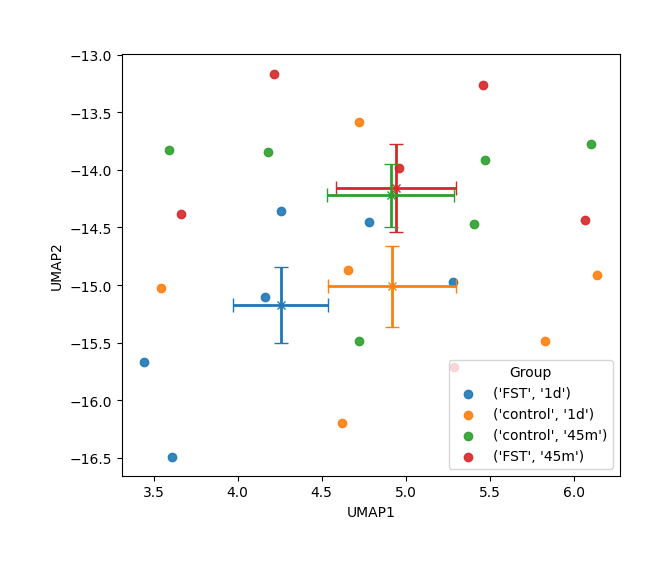

</div>

final summary
